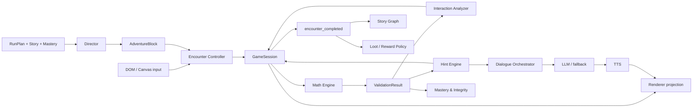
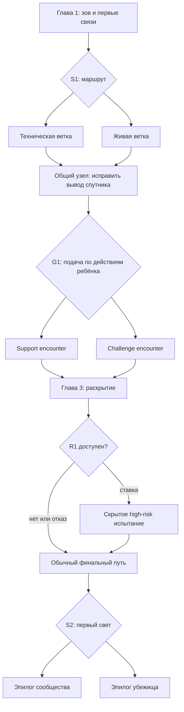

# LikaGame — спецификация демо-игры

Версия: 0.7.0
Статус: рабочая продуктово-геймдизайнерская и техническая спецификация  
Дата: 7 сентября 2026

## 1. Назначение документа

Этот документ описывает самостоятельное игровое демо LikaGame: интерактивную 2D-историю, внутри которой ребёнок решает задачи на умножение через действия с объектами мира.

Документ не является сокращением или обновлением прежнего бизнес-плана. Он заново фиксирует продукт на основании принятых игровых решений.

Демо должно ответить на три вопроса:

1. Воспринимает ли ребёнок происходящее как приключение, а не как тест с декорациями?
2. Может ли одна и та же математическая связь естественно появляться в разных физических игровых формах?
3. Создаёт ли реагирующий голосовой спутник ощущение живого персонажа и помогает ли он ребёнку без прямой выдачи ответа?

## 2. Короткая формула продукта

**LikaGame — интерактивный 2D-мультфильм, в котором ребёнок сам действует внутри сцены. Это не графическая новелла с карточками текста и не набор примеров с декорациями: математическая задача физически существует в мире, а её решение меняет этот мир и двигает сюжет.**

Ребёнок не решает `4 × 6`, чтобы затем увидеть анимацию открывшейся двери. Он заряжает четыре узла по шесть единиц, и поэтому дверь открывается.

Главная единица игры — не пример, а **encounter**: короткая ситуация длительностью примерно 30–90 секунд.

Базовый цикл encounter:

> ситуация в кадре → голос и мимика персонажа → действие ребёнка → реакция мира → при необходимости помощь → видимое последствие → продолжение истории

## 3. Границы демо

### 3.1. Что входит

- Два тематических сеттинга, выбираемых до запуска прохождения.
- Один общий сюжетный граф, адаптированный под каждый сеттинг не только словами, но и событиями, персонажами и объектами.
- Три короткие главы на одно прохождение.
- 18–25 минут на полное прохождение без необязательного R1; high-risk добавляет 2–4 минуты. Буфер до 28 минут допускается только для технической загрузки, переходов и accessibility-пауз и не считается целевой длительностью контента.
- 8 обязательных gameplay encounters, 2 короткие recall-пробы и не более одного high-risk encounter на забег.
- Два самостоятельных сюжетных выбора.
- Одна скрытая геймплейная развилка, зависящая от действий ребёнка.
- Два варианта финального эпилога в каждом сеттинге.
- Шесть действительно различных игровых loops и отдельный канал чистого recall.
- Три уровня математического представления: предметный, образный и recall.
- Один голосовой спутник, который комментирует действия, даёт ступенчатые подсказки и озвучивается через TTS.
- Детерминированная проверка математики, состояния сцены и сюжетных переходов.
- Короткие динамические реплики LLM в строго ограниченных рамках.
- Простая 2D-анимация персонажей, интерактивных объектов, фонов и эффектов.
- Забег, Рюкзак, постоянное Хранилище и случайный loot с редкостью.
- Небольшой бонус за решение с первого подтверждённого запуска.
- Адаптивно доступная high-risk ветка с выборочной ставкой предметов Рюкзака.
- Контур anti-cheat/калибровки для аномального или устойчиво запредельного результата.
- Поставка в формате Telegram Mini App с обязательным standalone browser mode для разработки и тестов.

### 3.2. Что не входит

- Отдельная нативная Telegram-игра, чтение переписки и отправка сообщений от имени ребёнка. Telegram используется только как контейнер запуска Mini App и источник проверяемой сессии.
- Самостоятельная регистрация по логину/паролю и полноценная система профилей в интерфейсе.
- Режимы родителя и ребёнка.
- Подписка, оплата, доступы и paywall.
- Родительская статистика и отчёты.
- Полный учебный курс или вся таблица умножения.
- Бесконечная генерация историй и сеттингов по свободному запросу.
- Генерация видео.
- Настоящий lip sync по фонемам.
- Свободный чат ребёнка с персонажем.
- Произвольные действия, не описанные схемой encounter.
- Магазин, покупная валюта и монетизация лута.
- Конкретное применение Хранилища на базе: ферма, строительство, коллекция или иная метаигра.
- Предметы, дающие математическое преимущество или пропускающие задания.
- Полноценная система сохранений между устройствами.
- Отдельные игровые механики для каждого сюжетного события.

### 3.3. Формат поставки

Демо — Telegram Mini App, то есть обычное HTTPS web-приложение, запущенное внутри Telegram WebView и подключённое к официальному Telegram Mini Apps JavaScript API. Та же сборка обязана запускаться в обычном браузере через `BrowserHost` без Telegram для локальной разработки, автоматических тестов и демонстрации по прямой ссылке.

Основной профиль MVP:

- landscape-first, логическая игровая область 1600×900 с адаптивным масштабированием;
- touch-first: tap/click и drag-and-drop являются основными способами управления;
- мышь поддерживает те же semantic actions, что и touch; hover никогда не является единственным способом обнаружить действие;
- экранная или системная клавиатура появляется только в специально объявленных `numeric_input`/`text_input` состояниях; свободного чата в демо нет;
- интерактивная сцена рисуется в canvas; React/DOM отвечает за меню, короткие игровые цели, поля ввода, загрузку и системные сообщения, но не показывает текст реплик персонажей;
- при portrait-положении показывается понятная просьба повернуть устройство; отказ fullscreen/orientation API не ломает прохождение;
- safe area Telegram, изменение viewport и появление клавиатуры не должны перекрывать героя, цель, commit-кнопку или важную реакцию мира.

При запуске Mini App вызывает `ready()` после загрузки минимального интерфейса, затем по возможности `expand()` и предлагает fullscreen из пользовательского действия. `requestFullscreen()` и orientation lock считаются улучшением, а не обязательным условием. При `deactivated`, `visibilitychange` или потере фокуса игра ставит активное время, таймеры и речь на паузу и сохраняет checkpoint.

Выбор тематического пакета передаётся через проверенный `start_param`, серверный RunPlan или dev-настройку. Отдельный экран выбора мира не является обязательной частью демо.

### 3.4. Горизонты документа и порядок обязательности

Документ намеренно хранит не только ближайший MVP, но и принятые продуктовые идеи для следующих версий. Наличие механики в спецификации не означает, что она должна блокировать первый playable build.

| Горизонт | Назначение | Что обязательно |
|---|---|---|
| `MVP-0 / playable spike` | как можно быстрее проверить запуск, touch, масштабирование и несколько math→world loops | одна тема на временных ассетах, Browser/Telegram host adapter, голосовой ввод в смысл умножения, E01 `allocate_equal`, E02 `program_then_run`, E03 `array_transform`, технический numeric-input smoke, локальные варианты реплик, checkpoint, telemetry и минимальный внешний мета-профиль |
| `Demo core` | проверить три вопроса раздела 1 | три главы «Маяк-7», основные encounters и recall, сюжет, H0–H5, авторские/fallback-реплики, базовый TTS |
| `Demo extended` | проверить расширенные системные идеи | второй Theme Pack, динамические реплики, loot, R1, pity, ledger и integrity fixtures |
| `Post-demo` | развивать повторяемость и долгосрочную метаигру | модульная сборка приключений из пула комнат, расширенный контент, ежедневные/недельные мягкие milestones, мета-база и серверно-авторитетная экономика |

Ни одна идея из позднего горизонта не удаляется. Она реализуется только после того, как её зависимости из более раннего горизонта работают и измеряются. Для каждого issue и pull request должен быть указан один из этих четырёх горизонтов.

### 3.5. Текущий реализованный локальный срез v0.7.0

Текущая сборка — расширенный `MVP-0`, а не весь объём Demo Core из §3.1. Она предназначена для быстрого локального тестирования ощущений, понятности управления, голоса и различий между механиками. Фиксированный маршрут проходит так:

```text
Browser launch
→ карта и короткая голосовая мультсцена
→ три голосовых мульт-бита: одинаковые группы → короткая запись → действия руками
→ E01 allocate_equal: 3 узла × 4 импульса
→ numeric-input smoke: общий заряд 12
→ E02 program_then_run: 3 повтора × 4 сектора
→ E03 array_transform: 4 ряда × 6 огней
→ локальный эпилог
```

В текущем срезе:

- одна тема — «Маяк-7» — и три фиксированные авторские комнаты;
- перед первым graded encounter станция на отдельном примере `3×2` показывает смысл умножения, не раскрывая решение ни одной комнаты;
- React 19 и Vite отвечают за web shell, карту и интерфейсные контролы, Phaser 4 — за игровую canvas-сцену E01;
- E01 поддерживает click/tap и drag-and-drop; E02 начинается с неполного `5×2=10`, показывает голубые точки остановок и золотые реле, а ребёнок тянет большую границу прыжка прямо по трассе; E03 начинается с `1×1`, постоянно показывает золотую форму замка `4×6=24`, а ребёнок растягивает прямоугольное выделение ламп. Числа являются live readout действий, а не основным способом ввода;
- реплики не выводятся текстом; ребёнок слушает голос и повторяет актуальную фразу тапом по говорившему персонажу;
- голосовые варианты заранее синтезированы через ElevenLabs и воспроизводятся из локальных файлов, без сетевого TTS в игровом runtime;
- выбор surface-варианта детерминирован для забега, поэтому reload и повтор реплики не создают случайной подмены фразы;
- checkpoint и обезличенная telemetry хранятся локально; отдельно сохраняется минимальный мета-профиль с ежедневной искрой, «Доброй серией» и уникальным знаком первого прохождения, который переживает reset забега; backend, PostgreSQL, серверная авторизация и production deployment в эту итерацию не входят.

Не реализованные здесь S1/G1/R1/S2, полный сюжет из трёх глав, второй Theme Pack, loot и генератор приключений остаются целевыми идеями следующих горизонтов и не удаляются из спецификации.

## 4. Целевая игровая сессия

Возраст первичного теста: 7–9 лет.

Полное прохождение состоит из трёх глав:

| Глава | Длительность | Функция |
|---|---:|---|
| 1. Зов | 5–7 минут | знакомство со спутником, миром и базовыми действиями |
| 2. Путь | 7–10 минут | сюжетная развилка, вариативные механики, первая серьёзная трудность |
| 3. Правда и запуск | 6–8 минут | раскрытие конфликта, адаптивная помощь, кульминация и эпилог |

После каждой главы должна существовать естественная точка остановки. Для демонстрационного теста главы могут проходиться подряд.

## 5. Учебная рамка демо

Демо не пытается научить всей таблице умножения. Оно показывает работу игрового и адаптивного ядра на ограниченном наборе фактов.

### 5.1. Факты демо

- Разогрев: `3 × 4 = 12`.
- Целевая связь A: `4 × 6 = 24`.
- Целевая связь B: `6 × 7 = 42`.
- Проверка переноса: чистый recall для `4 × 6` и `6 × 7` без возможности пересчитать видимые предметы.

Порядок множителей может меняться, но перестановка не должна автоматически считаться отдельным освоенным фактом. Игра может использовать `6 × 4` как проверку понимания переместительного свойства, однако в демо не вводит математический термин.

### 5.2. Три уровня представления

#### A. Предметный — Concrete

Ребёнок действует с видимыми группами и предметами. Он может получить ответ пересчётом.

Пример: четыре контейнера, в каждый нужно поместить шесть зарядов.

Назначение: показать структуру умножения и дать опору.

#### B. Образный — Representational

Группы видны, но все единицы внутри не показаны или собраны в неделимые комплекты.

Пример: четыре закрытых энергоблока с маркировкой «по 6»; нужно выбрать общий запас.

Назначение: связать ситуацию, группы и числовой факт, не позволяя решить всё одиночным пересчётом.

#### C. Воспроизведение — Recall

Сюжетный контекст остаётся, но ответ требуется вспомнить или вычислить без манипулятивной опоры.

Пример: «Шесть лучей, каждому нужно по семь зарядов. Сколько всего?» — цифровой ввод или выбор ответа.

Назначение: проверить именно математический факт, а не владение механикой.

### 5.3. Правило прогрессии

Каждая целевая связь должна встретиться минимум в двух разных физических формах и завершиться recall-проверкой.

Упрощённое состояние факта в пределах демо:

| Состояние | Условие | Следующее предъявление |
|---|---|---|
| `unknown` | факт ещё не встречался | `concrete` |
| `supported` | решён с визуальной опорой или H2+ | `concrete` или `representational` в другой механике |
| `promising` | самостоятельно решён в `representational` | `recall` |
| `fluent_in_demo` | быстро и самостоятельно решён в `recall` | короткая transfer-проверка позже |
| `struggling` | две ошибки, H3+ или длительный ступор | `concrete/representational` с другой стратегией помощи |

Это состояние действует только внутри текущего прохождения и не претендует на доказательство долгосрочного освоения.

## 6. Основные игровые принципы

### 6.1. Математика является причиной события

Успех обязан давать физически понятное последствие: узел загорается, мост достраивается, существо получает порцию, механизм начинает работать, путь открывается.

Нельзя завершать encounter только надписью «Правильно».

### 6.2. История не ставится на паузу ради задания

Интерактивные объекты уже находятся в сюжетной сцене. По возможности не открывается отдельная «карточка примера».

Исключение — короткий чистый recall, который сюжетно оформляется как срочный вопрос, код или последняя проверка системы.

### 6.3. Ошибка — состояние мира, а не наказание

При неверном действии:

- мир показывает, почему решение не сработало;
- прогресс не обнуляется без необходимости;
- объект можно вернуть или заменить;
- персонаж не стыдит ребёнка;
- после нескольких попыток игра меняет уровень помощи;
- encounter не превращается в бесконечный тупик.

Исключение — добровольный R1: после заранее подтверждённого единственного commit неверный результат может уничтожить только выбранный StakeEscrow. Учебный encounter после этого всё равно продолжается без экономического риска.

### 6.4. Разные механики проверяют разные умения

Успех в drag-and-drop не считается равным успеху в recall. Система хранит как минимум:

- правильность;
- количество попыток;
- время до первого осмысленного действия;
- время до решения;
- уровень использованной подсказки;
- способ ответа;
- возможность пересчитать предметы;
- самокоррекцию.

### 6.5. Программная механика отделена от сюжетной оболочки

В коде не существует `SpaceBatteryGame` или `DragonBerryGame`. Существуют универсальные игровые loops: `allocate_equal`, `partition_equal`, `program_then_run`, `array_transform`, `probe_and_diagnose` и `exact_budget_plan`.

Сеттинг определяет фон, персонажа, предметы, звуки, реплики и последствия, но не правила проверки.

### 6.6. Сюжетный выбор не имеет «неправильного» ответа

Математические ответы проверяются на правильность. Сюжетные решения выражают предпочтение ребёнка и не должны маскироваться под тест.

## 7. Игровые loops демо

Разнообразие считается по игровому циклу, а не по названию, сюжету или жесту. Tap, drag, resize и connect — способы управления. Recall, равные группы и поиск множителя — математические задачи. Игровой loop определяет, какую последовательность решений принимает ребёнок и какую новую информацию получает после каждого действия.

Два события считаются одной механикой, если в обоих случаях ребёнок фактически определяет готовый ответ и одним действием отправляет его на бинарную проверку. «Нажать 24», «перетащить ящик 24» и «вставить батарею 24» — один и тот же loop.

### 7.1. `allocate_equal` — распределить поровну

Ребёнок переносит отдельные предметы или связки между несколькими получателями. Успех зависит одновременно от общего количества и равенства групп.

Подходит для зарядки нескольких реакторов, распределения груза, корма, света или ремонтных комплектов.

Режимы:

| Режим | Что перемещается | Математическая опора |
|---|---|---|
| A1 | отдельные предметы | можно пересчитать каждую единицу |
| A2 | связки по 2–3 | требуется считать группами |
| B | неделимые упаковки «по 6/7» | единицей становится целая группа |

Правила:

- На сцене должно быть не менее двух адресатов; перенос одного правильного предмета в один слот не является `allocate_equal`.
- Не более 12 drag-действий на encounter.
- Неравномерность, недобор и перебор дают разные физические реакции.
- Предмет можно вернуть; промежуточная конфигурация не считается попыткой.
- `motor_miss` не увеличивает `evaluated_commit_count` и не влияет на mastery, loot или integrity-сигналы.

### 7.2. `partition_equal` — разделить готовое целое

Ребёнок не переносит все единицы по контейнерам, а ставит и двигает границы внутри уже существующей полосы, потока или цепочки.

Пример: разделить ленту из 24 огней на четыре равные секции или поток из 42 единиц — на шесть одинаковых каналов.

Игровой цикл:

> поставить границы → увидеть размеры частей → сдвинуть границы → запустить

Правила:

- Состояние хранится как позиции границ, а не как набор предметов в контейнерах.
- Неравные части должны быть заметны через длину, заполнение, баланс или поведение системы.
- Все границы свободно двигаются до commit.
- Если реализация заставляет разложить 24 отдельных объекта, это `allocate_equal`, а не новая механика.
- Допустим обратный режим: известно число частей и общий объём, требуется найти размер каждой.

### 7.3. `program_then_run` — запрограммировать и запустить

Ребёнок заранее собирает повторяющееся действие из параметров, затем наблюдает его выполнение во времени.

Пример: команда «шаг на 7» и «повторить 6 раз» должна привести робота к отметке 42.

Игровой цикл:

> задать размер действия → задать число повторений → предсказать → запустить → увидеть недолёт/перелёт/успех → изменить программу

Правила:

- Ребёнок сам задаёт минимум два параметра. Выбор одной из четырёх готовых программ считается `direct_answer`.
- После запуска результат разворачивается последовательно, чтобы было видно влияние каждого повторения.
- До commit доступны свободное редактирование и undo.
- Ошибка оставляет диагностичный след: где именно объект остановился и на сколько групп отличается план.
- Режим `template_and_replicate` допустим как разновидность: ребёнок строит одну группу, задаёт число копий и видит, как дефект шаблона размножается во всём тираже.

### 7.4. `array_transform` — построить двумерную структуру

Ребёнок независимо меняет два измерения объекта: число рядов и число элементов в каждом ряду.

Подходит для солнечной панели, окна маяка, рунной мозаики, карты звёзд или чешуи отражающей линзы.

Игровой цикл:

> изменить ширину/высоту → увидеть перестроение массива → сравнить структуру с целью → запустить

Правила:

- Выбор одной из готовых решёток не считается отдельным loop и маркируется `direct_answer`.
- Добавление только готовых одинаковых рядов считается упрощённым режимом, а не полной механикой.
- Полная версия позволяет свободно изменить обе размерности либо преобразовать исходный массив.
- `6×4` и `4×6` дают одинаковое количество; ориентация может иметь сюжетное значение, но не считается арифметической ошибкой.
- Для моторной доступности точный resize может дублироваться двумя крупными контролами рядов и столбцов.

### 7.5. `probe_and_diagnose` — исследовать и найти причину

Правильный ремонт невозможно выбрать до проверки нескольких гипотез. Ребёнок решает, какую часть системы протестировать, получает наблюдение и только затем вносит итоговое исправление.

Возможные причины: неверное число каналов, неверная ёмкость одного канала или неверный итоговый датчик.

Игровой цикл:

> выбрать проверку → получить симптом → исключить гипотезу → проверить следующую часть → починить → запустить

Правила:

- До первого содержательного probe причина не должна быть визуально очевидной.
- Результаты уже проведённых тестов сохраняются на сцене.
- Неверный ремонт даёт новый причинный симптом, а не только красный крест.
- Нельзя требовать пиксель-хантинга.
- Если ошибка уже подсвечена и её нужно просто заменить, это сюжетная оболочка `direct_answer`, а не диагностика.
- Для демо достаточно одного авторского showcase-encounter на прохождение; это самый дорогой loop.

### 7.6. `exact_budget_plan` — собрать точный план из ограниченных операций

Ребёнок комбинирует несколько доступных модулей или команд, чтобы получить точный итог при ограничении на слоты, ходы или типы ресурсов.

Пример: получить 42 как `2×7 + 4×7` либо `3×7 + 3×7`, когда прямого блока `6×7` нет.

Игровой цикл:

> изучить доступные ресурсы → составить последовательность → увидеть промежуточные суммы → запустить весь план → пересобрать

Правила:

- Должно существовать минимум два разумных плана либо значимое ограничение, влияющее на выбор.
- Если среди карточек лежит один готовый правильный ответ, это `direct_answer`.
- Недобор и перебор визуально различаются.
- Этот loop используется в безопасной форме до любой high-risk версии.
- Усложнённая версия является предпочтительным содержанием добровольной risk-ветки.

### 7.7. `direct_answer` — канал проверки, а не отдельная игра

Выбор числа, ввод на цифровой клавиатуре, выбор готового объекта и обычный multiple choice относятся к одному каналу ответа.

Он нужен для:

- короткого разогрева;
- чистого recall;
- проверки переноса без пересчитываемых предметов;
- финального ввода результата после игрового рассуждения;
- сюжетного выбора без математической правильности.

Правила:

- Чистый recall длится 5–20 секунд и не открывает сессию.
- Дистракторы создаёт Math Engine, а не LLM.
- `direct_answer` не учитывается при подсчёте разнообразия игровых loops.
- Нельзя ставить два чистых recall подряд.

### 7.8. Anti-duplicate критерий

Перед добавлением нового encounter команда отвечает на четыре вопроса:

1. Каков core verb ребёнка?
2. Как первое решение меняет последующие варианты?
3. Какую новую информацию даёт неудачный запуск?
4. Что ребёнок изменяет в следующей попытке кроме конечного числа?

Если ответы совпадают с существующим loop, событие является новой сюжетной оболочкой, но не новой механикой. Это допустимо для контентного разнообразия, однако не засчитывается как новый interaction type.

## 8. Модель encounter

На продуктовом уровне каждый encounter состоит из следующих частей:

| Поле | Назначение |
|---|---|
| `id` | стабильный идентификатор |
| `story_function` | зачем событие нужно истории |
| `learning` | канонический skill, структура задачи, представление, опора для пересчёта и сила evidence |
| `controller` | тип и variant одного из шести игровых loops либо `direct_answer` для recall |
| `input` | разрешённые semantic actions и контракт прямого ответа; физические touch/mouse нормализуются до них |
| `attempt_policy` | объект с режимом commit, числом оценённых запусков, checkback и hint policy |
| `scene_ref` и `role_bindings` | композиция сцены и семантические роли интерактивных объектов |
| `validation` | `validator_id` и декларативные параметры; исполняемые выражения в JSON запрещены |
| `feedback_plan_ref` и `dialogue_refs` | разрешённые реакции и проверенные/fallback-реплики |

`chapter_id`, маршрут, story flags и theme bindings принадлежат `AdventureBlock`, а не математическому encounter. Единственный сериализуемый контракт `EncounterDefinition` приведён в §28.3; при любом расхождении приоритет имеет §28. Например, `6×4` может дать `math_status=correct`, но `scene_status=equivalent_but_misaligned` для шлюза `4×6`; это не арифметическая ошибка. LLM не изменяет encounter или validation.

## 9. Живой спутник: поведение, AI и TTS

### 9.1. Роль персонажа

Спутник выполняет четыре функции:

1. Встраивает математическую цель в происходящее.
2. Показывает эмоциональную реакцию мира.
3. Замечает характер действий ребёнка.
4. Даёт педагогически контролируемую помощь.

Он не является судьёй и не повторяет «правильно/неправильно» после каждого действия.

### 9.2. Какие события замечает система

Interaction Analyzer детерминированно сворачивает поток действий в понятные состояния:

- `quick_correct` — быстрый самостоятельный успех;
- `deliberate_correct` — долго думал, но решил без подсказки;
- `correction_observed` — изменил уже проверенный неверный candidate в продуктивном направлении;
- `productive_start` — начал верно, но ещё не завершил;
- `idle` — нет осмысленных действий заданное время;
- `single_wrong` — одна ошибка;
- `repeated_same_error` — повторяется один тип ошибки;
- `different_errors` — меняются неверные гипотезы;
- `almost_complete` — остался один логический шаг;
- `random_input_suspected` — быстрый бессистемный перебор семантических действий;
- `motor_difficulty_suspected` — математический замысел верен, но drag не удаётся;
- `overfilled` / `underfilled` / `uneven_groups` — конкретное состояние модели.
- `unequal_partitions` — границы создали неравные части;
- `invalid_dimensions` — двумерная структура имеет неверные параметры;
- `valid_plan_draft` / `plan_committed` — программа или ресурсный план готов/запущен;
- `simulation_undershoot` / `simulation_overshoot` — план дал недобор/перебор;
- `evidence_collected` / `unproductive_probe` — диагностическая проверка дала или не дала новое знание;
- `diagnosis_mismatch` — итоговый ремонт не соответствует собранным данным;
- `budget_under` / `budget_over` — ограниченный план не достиг или превысил цель.

LLM не получает сырой поток координат и не диагностирует ребёнка самостоятельно.

### 9.3. Candidate, commit и редкая самопроверка

Система разделяет свободное построение решения и оценённую попытку:

- `candidate` — текущая конфигурация; её можно собирать, разбирать и менять без штрафа;
- `commit` — осознанный игровой запуск: нажать рычаг, отправить программу, включить маяк;
- `clear_kind=first_commit` — первый оценённый commit верен до любой реакции, зависящей от правильности;
- `clear_kind=corrected_before_h1` — ребёнок исправил уже отправленную ошибку до H1;
- `clear_kind=assisted` — решение завершено после H1+.

Моторный промах, undo, перестановка незаконченного candidate и системная ошибка не считаются попыткой.

Иногда после первого `commit_requested`, но до оценённого запуска, Math Engine делает скрытый preview полного candidate. Если candidate правдоподобен, но неверен, Hint Engine может предложить самопроверку `C0`:

> «Запускаем так или ещё посмотрим?»

`C0` не содержит математической стратегии, но является сигналом, зависящим от ошибки. Поэтому после его показа `first_clear_eligible=false`: исправленное решение получает `clear_kind=self_corrected_after_checkback`, а подтверждённый прежний candidate становится первым оценённым неверным commit. Для R1 используется отдельное подтверждение, которое показывается при любом candidate независимо от правильности.

Условия `C0`:

- первый `commit_requested`; оценённого commit в этом encounter ещё не было;
- candidate был полным и оставался стабильным хотя бы 1,5 секунды;
- ошибку можно заметить повторным осмотром сцены;
- ещё не было содержательной подсказки;
- нет `motor_miss`, `random_input_suspected`, assessment или активного таймера;
- ребёнок не начал исправляться самостоятельно в течение 600 мс;
- checkback не использовался в этом encounter.

Cadence:

- не более одного `C0` в главе и двух за прохождение;
- не в соседних encounter и не чаще одного раза в 60 секунд;
- по умолчанию — на втором подходящем событии, а не на каждой первой ошибке;
- если ребёнок дважды игнорирует такую реакцию, она отключается до конца прохождения;
- после выбора «проверить» игра даёт 5–8 секунд без новой реплики или подсветки.

Policy принимает Hint Engine детерминированно. LLM может изменить формулировку в пределах разрешённого intent, но не решает, когда задавать вопрос.

### 9.4. Лестница подсказок

| Уровень | Содержание | Пример |
|---|---|---|
| H0 | эмоциональная реакция без помощи | «Хм, маяк пока молчит.» |
| H1 | направить внимание | «У нас четыре секции, и каждой нужно по шесть.» |
| H2 | назвать стратегию без ответа | «Собери сначала две шестёрки, потом ещё две.» |
| H3 | добавить визуальную опору | подсветить две пары групп и проговорить разбиение |
| H4 | провести почти до ответа | «Две шестёрки — двенадцать. А таких пар две.» |
| H5 | завершить вместе и запланировать повтор | «Получилось двадцать четыре. Проверим это ещё раз дальше.» |

Переходы между уровнями задаёт Hint Engine.

Ориентировочные триггеры:

- первый preview неверного полного candidate при `commit_requested` → редкий `C0`, если выполнены условия; если C0 не показан, commit сразу оценивается и даёт H0;
- подтверждение прежнего неверного решения после `C0` → H0 и причинная реакция мира;
- 6–8 секунд без действия после H0 или вторая содержательная ошибка → H1;
- повтор ошибки после H1 → H2;
- ещё 8–10 секунд или третья ошибка → H3;
- отсутствие прогресса после H3 → H4;
- `active_solve_ms` достигло 70–75 секунд либо ребёнок дважды не завершил guided step → H5; guided completion должен закончить обязательный encounter не позднее 90 секунд активного времени.

Порог времени должен настраиваться после наблюдений за детьми. Бездействие во время озвучивания и анимации не считается `idle`.

### 9.5. Безопасное разделение ответственности

**Math Engine определяет:**

- математическую структуру задачи и canonical solution relation;
- результат проверки candidate: `math_status`, `scene_status`, `error_class` и mastery evidence;
- проверяемые числа и отношения, которые Hint Engine может использовать по policy.

Допустимые действия принадлежат Encounter Controller, уровень и стратегия помощи — Hint Engine, а переходы и завершение — `GameSession`. Эти границы подробно зафиксированы в §§27–28.

**LLM определяет только:**

- краткую естественную формулировку;
- интонационное намерение;
- обращение к объектам сцены;
- вариант похвалы или поддержки;
- одну эмоцию и один жест из разрешённых enum.

**LLM запрещено:**

- вычислять или менять ответ;
- придумывать новую механику;
- открывать непредусмотренный сюжетный переход;
- назначать награду или наказание;
- делать выводы о способностях ребёнка;
- использовать стыд, угрозы, сарказм или давление;
- запрашивать у ребёнка личные данные;
- поддерживать свободный диалог.

### 9.6. Контракт динамической реплики

Единственный исполнимый request/response-контракт, защита по `request_id/context_revision`, policy математических slots и fallback описаны в §28.9. Произвольный prompt с полями вроде `required_math_statement` или простая проверка отсутствия строки с ответом контрактом не считаются.

До показа и TTS ответ проходит schema, length, enum, safety и semantic-slot validation. Ошибка, timeout или устаревшая revision немедленно переводят запрос на заранее проверенную fallback-реплику.

### 9.7. Когда динамическая генерация оправдана

LLM вызывается только для событий, где вариативность заметна:

- первая или повторная ошибка;
- самокоррекция;
- необычно быстрый успех;
- успех после долгого размышления;
- переход к новой стратегии подсказки;
- короткая сюжетная реакция на выбранную ветку.

Стандартные инструкции, критически важные факты сюжета и H4–H5 должны иметь авторские варианты и не зависеть от генерации.

### 9.8. TTS и ощущение речи

- Озвучивается спутник и ключевой сюжетный NPC.
- Текст реплики не показывается на экране: нет баблов, карточек диалога и постоянно видимых субтитров в основном детском интерфейсе.
- Пока звучит реплика, говорящий персонаж остаётся главным визуальным фокусом, двигает ртом и поддерживает речь позой, глазами или жестом.
- Tap/click по говорившему персонажу с начала повторяет его последнюю актуальную реплику; повтор отменяет предыдущее воспроизведение и не создаёт новую domain-команду.
- Короткие игровые подписи разрешены только как интерфейс действия — например, цель, счётчик или название кнопки. Они не цитируют и не пересказывают речь персонажа.
- В playable spike используется честный двухкадровый fake lip sync «закрыт/открыт» по таймеру воспроизведения; в Demo Core рот переключается между тремя состояниями по amplitude envelope: закрыт, полуоткрыт, открыт.
- В паузах рот закрыт; глаза и дыхание продолжают idle-анимацию.
- Длинная реплика — максимум 8–10 секунд. Инструкции желательно укладывать в 5–7 секунд.
- Ребёнок может начать действовать до конца озвучивания, если смысл уже понятен. Игра не блокирует сцену без сюжетной необходимости.
- Динамическая реплика не должна замораживать игру в ожидании TTS. Пока звук готовится, персонаж реагирует позой или коротким локальным звуком.
- Если сетевой TTS не готов за целевой срок, немедленно запускается заранее подготовленная локальная озвучка той же реплики; устаревшая реплика не может догонять уже изменившееся состояние.
- Если недоступно вообще всё аудио, игра показывает системную проблему звука и сохраняет возможность повторить попытку. Сюжетная реплика всё равно не превращается в текстовый бабл; критическая игровая цель должна оставаться понятной по композиции сцены, пиктограммам и коротким UI-меткам.

Целевой бюджет задержки для динамической реакции: визуальный отклик до 150 мс, начало готовой/cached реплики до 400 мс, начало новой TTS-реплики желательно до 2 секунд и не позднее 3 секунд.

Профиль текущего локального playable:

- все реплики заранее синтезируются через ElevenLabs и лежат в runtime как MP3; запросов к провайдеру во время прохождения нет;
- Пик использует voice ID `rSfuQoQ3FY8SVKeraMAp`, диспетчерская — `Vl27Cllkuw8BhyPqus2n`;
- для одного смыслового cue хранится несколько проверенных авторских surface-вариантов с отдельными `line_id` и файлами;
- вариант выбирается стабильной функцией от `run_id` и occurrence, а нажатие на персонажа повторяет уже выбранный файл;
- API key читается только локальным generation-скриптом из переменной окружения либо из внешнего fallback `~/Documents/tts-play-rehearsal/.env`, путь к которому можно переопределить через `ELEVENLABS_ENV_FILE`; ключ не копируется в проект и не попадает в client bundle, контентный JSON, manifest или git;
- текущий двухкадровый fake lip sync зависит от фактического состояния воспроизведения. Закрытый и открытый кадры сохраняют одну палитру персонажа, чтобы речь не выглядела как мигание между разными состояниями.

Эта схема является быстрым и надёжным fallback-путём для Demo Core. On-demand TTS и динамические LLM-реплики подключаются позже и не вытесняют проверенный локальный каталог.

## 10. Режиссура сессии — Director

Director — детерминированный модуль, который выбирает темп и форму следующего encounter. Это не LLM.

### 10.1. Разделение компонентов

| Компонент | Единственный главный вопрос |
|---|---|
| Math Engine | что ребёнку сейчас нужно решить и что математически верно? |
| Director | каким способом и в каком темпе это предъявить? |
| Story Graph | зачем это действие происходит сейчас и куда ведёт? |
| Scene Builder | какие сущности и состояния должны находиться в сцене? |
| Interaction Engine | что ребёнок может нажать, перетащить или изменить? |
| Interaction Analyzer | что означает наблюдаемая последовательность действий? |
| Hint Engine | нужна ли помощь, какого уровня и с какой стратегией? |
| Mastery & Integrity Engine | доступен ли risk-tier и нужно ли перепроверить аномальный результат? |
| Loot Engine | какую награду создать, что находится в Рюкзаке, ставке и Хранилище? |
| Dialogue Orchestrator | нужна ли авторская, fallback- или динамическая реплика? |
| LLM | как кратко и естественно сформулировать разрешённый смысл? |
| TTS | как воспроизвести утверждённую реплику голосом? |
| Renderer | как показать текущее детерминированное состояние? |

Поток выбора блока и одного encounter:



Director вызывается между блоками, а не проверяет каждое действие внутри encounter. Loot/Reward Policy получает только разрешённый domain event после завершения, никогда — сырой сигнал Interaction Analyzer. Ни LLM, ни TTS не находятся в критическом пути проверки действия: сцена остаётся играбельной при их полном отключении.

### 10.2. Правила темпа

Он учитывает:

- какие факты нужно предъявить;
- состояние факта `unknown/supported/promising/struggling/fluent_in_demo`;
- последние использованные gameplay loops;
- число сложных encounter подряд;
- число подсказок;
- продолжительность прохождения;
- выбранную сюжетную ветку;
- состояние Рюкзака и возможность поставить часть добычи;
- `risk_eligibility`, `challenge_tier` и `risk_offer_state` как три независимые оси;
- необходимость дать ребёнку короткий success moment;
- необходимость завершить главу вовремя.

Правила демо:

- Не более двух encounter с одной механикой подряд.
- После encounter с H3+ следует более короткая и поддерживающая задача.
- Нельзя ставить два чистых recall подряд.
- В каждой главе есть хотя бы одно физическое изменение большой части сцены.
- Последний математический encounter главы не заканчивается на ошибке: при необходимости используется guided completion.
- Скрытая ветка сложности меняет представление и поддержку, но не лишает ребёнка сюжетного контента.
- High-risk не заменяет обязательный encounter и появляется не более одного раза за забег.
- Новая игровая механика или новая математическая форма сначала встречается без ставки.

## 11. Сюжетная архитектура

### 11.1. Общий каркас

Оба сеттинга используют один макрограф:

1. Герой получает необычный сигнал о помощи.
2. Спутник пытается восстановить главный источник света/связи.
3. Для доступа к центру требуется вернуть миру несколько работающих связей.
4. Ребёнок выбирает один из двух маршрутов.
5. На маршруте обнаруживаются следы предполагаемого «вредителя».
6. Спутник делает поспешный неверный вывод.
7. Ребёнок исправляет техническую/магическую ошибку и узнаёт, что «вредитель» пытался предотвратить большую аварию.
8. Финальная задача восстанавливает систему безопасно.
9. Ребёнок решает, кому или чему дать свет в первую очередь.
10. Мир показывает один из двух эпилогов.

Это не две копии с заменой слов. Совпадают драматургические функции и gameplay loops; конкретная причина конфликта, характер персонажей, композиции сцен и визуальные последствия отличаются.

Граф ветвления:



### 11.2. Типы ветвления

#### Ветка S1 — осознанный выбор маршрута

Ребёнок выбирает, куда идти. Оба варианта равноценны и содержат разные сцены/оболочки, но один и тот же объём математики.

Ветка расходится на один крупный encounter и затем возвращается в общий узел. Выбор сохраняется и упоминается в финале.

#### Ветка G1 — скрытая адаптивная ветка

После завершения E05 Director выбирает подачу E06. Решение использует evidence E01–E05, при этом последние четыре сопоставимых encounter имеют больший вес:

- `support_path` — предметная/образная задача с более ранней визуальной подсказкой;
- `challenge_path` — `program_then_run` без пересчитываемых единиц.

Ребёнку не сообщается, что одна ветка «лёгкая». Сюжетно это два естественных способа решить проблему.

#### Ветка R1 — добровольный high-risk

После безопасного знакомства со всеми необходимыми навыками Mastery & Integrity Engine может открыть необязательный боковой маршрут. Не готовый к нему ребёнок не видит закрытой кнопки или упущенной награды.

Игрок выбирает часть предметов Рюкзака, видит risk envelope и подтверждает вход. Точные числа, композиция и конкретные модификаторы раскрываются только после фиксации ставки. Успех возвращает выбранные предметы и выдаёт дополнительные loot-roll; неуспех отнимает только поставленные предметы. Ветка всегда возвращается на обычный финальный путь.

#### Ветка S2 — финальный ценностный выбор

После восстановления системы ребёнок выбирает, куда направить первый свет. Оба решения правильные и создают разные эпилоги.

Выбор не влияет на математическую оценку.

### 11.3. Ограничение комбинаторного взрыва

- Одновременно активна максимум одна расходящаяся сюжетная сцена.
- Каждая развилка возвращается в общий узел не позднее чем через один encounter.
- Story flags влияют на 1–2 последующие реплики и финальный кадр, но не создают новые главы.
- В демо нет веток, открывающихся случайно.
- Никакая ветка не требует уникальной программной механики.
- R1 не содержит эксклюзивной концовки, обязательного сюжетного факта или единственного способа получить тип предмета.

Story state демо:

```text
theme = space | dragons
route = technical | living
adaptive_route = support | challenge
risk_eligibility = unavailable | eligible | expert_eligible
challenge_tier = none | basic | expert | verification
risk_offer_state = hidden | offered | declined | locked | resolved
risk_result = not_offered | declined | success | failure
final_priority = community | sanctuary
fact_4x6_state = ...
fact_6x7_state = ...
```

## 12. Карта прохождения и encounters

### 12.0. Ввод в смысл умножения до заданий

До E01 ребёнок видит не объясняющий текст и не школьное определение, а три коротких voice-only мульт-бита о том, как устроены системы станции:

1. **Одинаковые группы.** Предметы сами собираются в три контейнера по две искры; цветом связаны границы групп и одинаковое количество внутри.
2. **Короткая запись.** Видимое `2 + 2 + 2` собирается в `3 × 2 = 6`. Это отдельный учебный пример, который не совпадает с ответом ближайшей комнаты.
3. **Одно правило — три действия.** Три голограммы показывают: разложить поровну, повторить одинаковый шаг и растянуть прямоугольную решётку.

Персонажи произносят смысл голосом и двигают ртом; их реплики не дублируются текстом. На экране разрешена постоянная короткая UI-грамматика `Группы × В каждой = Всего`, потому что это обозначение состояния мира, а не субтитр. Каждый beat можно повторить тапом по говорившему персонажу, переход ждёт фактического окончания аудио.

Цель ввода — дать ребёнку рабочую модель умножения до первой проверки, но не превратить спутника в диктовщика решения. В encounters Пик называет наблюдаемое действие и признаки цели, а не готовые множители или последовательность кликов.

Одна строка — один обязательный beat. Theme Pack меняет сюжетную реализацию, но не основной loop.

| ID | Функция | Факт | Controller / block kind | `representation` | `counting_support` | `evidence_strength` | `challenge_tier` / ветка |
|---|---|---|---|---|---|---|---|
| E01 | разбудить спутника | `3×4=12` | `allocate_equal` | `concrete` | `full` | `supported` | `none` |
| E02 | вернуть первую связь | `3×4=12` | `program_then_run` | `representational` | `grouped_only` | `supported` | `none` |
| E03 | открыть путь | `4×6=24` | `array_transform` | `representational` | `grouped_only` | `independent` | `none` |
| S1 | выбрать маршрут | — | `story_choice` block | — | — | — | `technical/living` |
| E04-T | пройти технический маршрут | `4×6=24` | `partition_equal` | `representational` | `full` | `supported` | S1 `technical` |
| E04-L | пройти живой маршрут | `4×6=24` | `partition_equal` | `representational` | `full` | `supported` | S1 `living` |
| E05 | проверить вывод спутника | `6×7=42` | `probe_and_diagnose` | `representational` | `partial` | `independent` | `none` |
| E06-S | добраться до центра с опорой | `6×7=42` | `allocate_equal` | `concrete` | `grouped_only` | `supported` | G1 `support` |
| E06-C | добраться до центра напрямую | `6×7=42` | `program_then_run` | `representational` | `none` | `independent` | G1 `challenge` |
| E07 | доказать истинную причину сбоя | слабейший факт | выбранный знакомый controller | значение выбранного definition | значение выбранного definition | значение выбранного definition | `none` |
| Q46 | назвать цель безопасной сборки | `4×6=24` | `direct_answer` | `recall` | `none` | `recall` | `none` |
| E08 | собрать безопасную систему | `4×6=24` | `exact_budget_plan` | `representational` | `grouped_only` | `independent` | S1 binding |
| R1 | необязательная боковая находка | освоенный факт | выбранный знакомый controller | значение выбранного definition | значение выбранного definition | значение выбранного definition | `basic/expert/verification` |
| Q67 | аварийная финальная проверка | `6×7=42` | `direct_answer` | `recall` | `none` | `recall` | `none` |
| S2 | направить первый свет | — | `story_choice` block | — | — | — | два эпилога |

Статус v0.7.0: в локальном playable реализованы вводные мульт-биты, E01, E02, E03 и отдельный технический numeric-input smoke между E01 и E02. Остальные строки таблицы описывают целевой Demo Core и не должны интерпретироваться как уже готовый контент.

E07 и R1 сначала выбирают ссылку на один опубликованный `EncounterDefinition`; после выбора все три learning-поля имеют одно конкретное значение. `expert` и `verification` относятся только к `challenge_tier`, а не к представлению материала.

В одном прохождении ребёнок получает восемь обязательных gameplay encounters E01–E08, две короткие recall-пробы Q46/Q67 и не более одного необязательного R1. Префикс `E` обозначает gameplay encounter, `Q` — измерительную recall-пробу, `R` — добровольную risk-ветку. Оба варианта S1 используют одинаковый `partition_equal`, а G1 меняет форму `allocate_equal/program_then_run` без урезания сюжета.

Полное прохождение гарантированно знакомит ребёнка со всеми шестью loops:

```text
allocate → program → array → partition → diagnose
→ supported allocate / challenge program → adaptive reinforcement
→ exact budget → recall
```

E07 выбирает слабейший факт, исключает loop из E06 и по возможности не повторяет последнюю механику этого факта. Q46 проводится до появления ресурсных блоков E08, чтобы ребёнок не мог просто пересчитать готовые варианты.

## 13. Забег, loot, high-risk и anti-cheat

### 13.1. Контур метаигры в демо

Один забег — прохождение трёх глав выбранного сеттинга. Внутри забега ребёнок получает предметы в Рюкзак, может один раз добровольно поставить часть из них в high-risk encounter, а в конце переносит оставшуюся добычу в постоянное Хранилище.

Для MVP-0 без внешних пользователей Vault и игровые метрики могут храниться в локальном fixture-профиле. В доступном извне Demo Core после Telegram auth авторитетным становится PostgreSQL, а IndexedDB остаётся crash cache. Между забегами состояние сохраняется; полноценная UX-поддержка синхронизации и конфликтов между несколькими устройствами не требуется.

В демо фиксируется сам цикл получения, риска и сохранения. Применение Хранилища на базе остаётся открытым: это может быть коллекция, ферма, восстановление пространства, декоративное строительство или другая метаигра. Редкость пока имеет коллекционное и эмоциональное значение, но не даёт математической силы и не открывает эксклюзивный сюжет.

#### 13.1.1. Мягкое возвращение и внешние награды

В локальном playable v0.7.0 уже есть минимальный контур мета-прогрессии, отделённый от состояния забега:

- один раз за новую локальную календарную дату ребёнок по желанию забирает фиксированный подарок `+1 signal_spark` — «Искру сигнала»;
- получение увеличивает «Добрую серию» на один визит; пропуск лишь замораживает значение и никогда не сбрасывает его, не уменьшает баланс и не требует восстановления;
- первое завершение опубликованного приключения `adventure.mayak7.v1` один раз открывает уникальный предмет `collectible.mayak7_beacon_core.v1` — «Знак хранителя Маяка-7»;
- предмет сразу попадает в постоянное Хранилище, не участвует в ставках, не расходуется и не усиливает ребёнка в математических заданиях;
- повторное прохождение, reload и reset активного забега только подтверждают наличие знака и не создают дубликат.

Daily-карточка не является модальным барьером: приключение можно начать, не забирая подарок. В header во время прохождения виден только компактный баланс искр; серия не отвлекает от задания. На эпилоге наградный reveal начинается после окончания реплики и сообщает, что предмет вынесен из забега.

Мета-профиль хранится отдельно от `DemoSnapshot`, не инвалидируется при смене `content_version` и не очищается действием «Начать заново». Стабильные ключи идемпотентности:

```text
daily:<local YYYY-MM-DD>
adventure-first-clear:adventure.mayak7.v1
```

Локальный клиент трактует дату best-effort: за одну дату возможен максимум один claim; перевод часов назад не выдаёт подарок и ничего не конфискует; большой скачок вперёд даёт максимум текущий подарок без backfill. После подключения backend источником даты, баланса и журнала выдач становится сервер, а commit награды и запись grant выполняются атомарно до визуального reveal.

Обязательные ограничения для детского продукта: нет случайной daily-награды, countdown и near-miss; нет множителя за длинную серию; нет платного восстановления серии; награда не зависит от скорости, первой попытки и подсказок; нет потери уже полученного за отсутствие. В playable искры пока не расходуются — они проверяют само существование внешнего прогресса.

Дальнейшие необязательные элементы вовлечения: альбом коллекции, косметическое восстановление базы, накопительные milestones визитов, достижения за исследование разных представлений умножения и спокойные еженедельные открытки о прогрессе. Они не должны ограничивать сюжет, подсказки или учебный контент и подключаются только после наблюдаемой проверки базового loop.

Состояния инвентаря:

- `Vault` — постоянное Хранилище между забегами; никогда не участвует в списании high-risk;
- `Backpack` — незабанкованный loot текущего забега;
- `StakeEscrow` — конкретные предметы Рюкзака, выбранные и временно заблокированные для испытания;
- `pending_reward_resolution` — незавершённая серверная операция, которая ещё не изменила inventory и не показывается игроку;
- `reward_reveal_queue` — ID уже committed transactions, ожидающие только визуального reveal; показ не меняет domain state.

Минимальные поля предмета:

```text
catalog_item_id
item_instance_id
theme_id
visual_variant
rarity
stakeable
unique
run_origin
```

Сюжетные и уникальные предметы не являются частью расходуемой экономики.

### 13.2. Базовая награда и first-clear

Каждый завершённый обязательный математический encounter, включая recall-пробу, выдаёт один гарантированный `Base roll` независимо от числа попыток и подсказок. Это не позволяет ребёнку, которому требуется больше помощи, остаться без мета-прогресса.

Необязательный R1 не создаёт отдельный Base roll и не двигает pity. Его экономика исчерпывается заранее показанной ставкой, возвратом поставленных предметов при успехе и дополнительными Risk rolls. Поэтому доступность R1 для сильного игрока не ускоряет гарантированные Rare/Epic относительно ребёнка, проходящего только основной маршрут.

Если в обязательном encounter первый оценённый commit верен до correctness-contingent реакции, дополнительно выдаётся независимый `First-clear roll` с улучшенными шансами редкости. На R1 этот бонус не распространяется.

Каноническое условие Reward Policy: `first_clear_roll_eligible = (clear_kind == first_commit)`.

- Изменение draft/candidate до commit не отменяет бонус.
- Motor miss и техническая ошибка не отменяют бонус.
- Исправление после необязательного `C0` получает `clear_kind=self_corrected_after_checkback`: Base roll остаётся, First-clear roll не выдаётся.
- Решение после H1+ получает Base roll, но не First-clear roll.
- Скорость сама по себе не меняет rarity odds обычной награды.

### 13.3. Редкость и случайное выпадение

В демо используются четыре тира:

| Tier | Рабочее название | Роль |
|---|---|---|
| `common` | обычный | основной объём коллекции и безопасная первая ставка |
| `uncommon` | необычный | заметно более редкий визуальный вариант |
| `rare` | редкий | яркая находка с отдельным reveal-эффектом |
| `epic` | эпический | верхний tier демо, не участвует в ставках |

Цвет редкости всегда дублируется названием, формой рамки и иконкой, чтобы различие не зависело только от цветовосприятия.

Стартовые odds:

| Источник | Common | Uncommon | Rare | Epic |
|---|---:|---:|---:|---:|
| Base roll | 70% | 24% | 5% | 1% |
| First-clear roll | 45% | 40% | 12% | 3% |
| Risk roll от Common | 20% | 50% | 25% | 5% |
| Risk roll от Uncommon | 0% | 55% | 35% | 10% |
| Risk roll от Rare | 0% | 0% | 80% | 20% |

Успешный high-risk возвращает каждый поставленный предмет без изменения и создаёт по одному независимому `Risk roll` на каждый предмет. Risk roll не может быть ниже редкости соответствующей ставки.

Пример: поставленный Uncommon при успехе возвращается в Рюкзак и дополнительно создаёт одну находку: 55% Uncommon, 35% Rare, 10% Epic.

#### Pity-защита

- После семи подряд Base roll ниже Rare восьмой Base roll гарантированно даёт Rare+: 90% Rare, 10% Epic.
- После 29 Base roll без Epic тридцатый гарантированно даёт Epic.
- Это два независимых счётчика: `rare_pity_count` сбрасывается Base-находкой Rare или Epic, а `epic_pity_count` — только Base-находкой Epic.
- Если обе гарантии должны сработать на одном Base roll, Epic pity имеет приоритет и выпавший Epic сбрасывает оба счётчика.
- Только Base roll двигает и сбрасывает эти счётчики; находки из First-clear и Risk rolls не ускоряют и не обнуляют их.
- Игрок может увидеть простой индикатор: «Редкая базовая находка — не позже чем через N заданий».

Это гарантирует редкие находки независимо от учебной успешности и не превращает бонусы сильного игрока в единственный путь к ценному loot.

### 13.4. Детерминированный random и защита от reroll

Редкость случайна для игрока, но результат воспроизводим технически. Для каждого reward slot фиксируются:

```text
reward_nonce
odds_table_version
loot_catalog_version
pity_snapshot
run_id
encounter_instance_id
reward_slot_id
ordered_stake_item_ids
challenge_seed
```

Из зафиксированного seed детерминированно вычисляются не только rarity, но и конкретные `catalog_item_id`, `item_instance_id` и `visual_variant` из версионированного каталога. Resolved item сначала входит в `transaction_pending`, затем одной атомарной операцией зачисляется и получает `transaction_committed`; только ID committed transaction попадает в `reward_reveal_queue`. Reload, reconnect, повторный callback и перезапуск приложения восстанавливают тот же предмет; новый случайный результат не создаётся.

У reward transaction projection есть явный `status`: `pending`, `committed` или `refunded`. До авторитетного зачисления создаётся `pending`, после атомарной записи результата — `committed`. Reveal происходит после commit. Операции идемпотентны: один `transaction_id` не может повторно выдать предмет или повторно списать ставку.

В локальном демо достаточно детерминированного seeded PRNG. При серверной реализации seed рассчитывается сервером/HMAC и не доверяется клиенту.

### 13.5. Доступность high-risk

Risk-контракт не смешивает доступность, сложность и жизненный цикл предложения:

```text
risk_eligibility = unavailable | eligible | expert_eligible
challenge_tier = none | basic | expert | verification
risk_offer_state = hidden | offered | declined | locked | resolved
```

Если ребёнок пока не справляется с базовыми encounter, он видит только основной маршрут. Игра не показывает закрытый заманчивый проход, серый замок или сообщение «недостаточный уровень».

Первичная eligibility оценивается по последним восьми сопоставимым encounter одного уровня навыка. Сначала берутся события текущего run, затем при нехватке — история того же профиля с теми же `skill_family`, `representation_band` и `controller_difficulty_band`. События другого тестового профиля никогда не попадают в окно:

- минимум 6/8 правильных первых commit;
- минимум 7/8 завершены без H2+;
- нужный факт решён минимум в двух представлениях;
- хотя бы один успех получен без пересчитываемой опоры;
- базовый loop будущего испытания уже пройден безопасно;
- нет текущего motor/frustration/technical flag.

Скорость — дополнительный, а не главный сигнал. Используется только `active_solve_ms`: время, когда semantic controls разблокированы и приложение активно. Если ребёнку разрешено действовать во время TTS, это время учитывается; сама играющая речь не вычитается автоматически. Background, блокирующая анимация, native keyboard transition, техническая задержка и подтверждённый моторный сбой исключаются. Пороги калибруются отдельно по loop; drag нельзя сравнивать с direct answer.

Eligibility имеет hysteresis: один неверный ответ не закрывает уже доступный tier. После проигранного high-risk действует cooldown один забег.

Если к точке R1 ещё нет восьми сопоставимых событий, production-профиль остаётся `unavailable`. В демонстрационной и тестовой сборке предусмотрены явно помеченный fixture-профиль и dev override для принудительного открытия всех tier и веток; они не компилируются в production-конфигурацию.

### 13.6. Выбор конкретной ставки

Ребёнок выбирает предметы только из текущего `Backpack`. `Vault` не показывается как источник ставки и не может быть списан.

Вес риска:

```text
Common = 1
Uncommon = 2
Rare = 4
Epic = non-stakeable
```

Ограничения:

- первая high-risk ставка профиля — ровно один Common;
- далее можно выбрать один или два предмета;
- `stakeWeight ≤ min(4, floor(totalStakeableBackpackWeight / 2))`;
- минимум половина доступной ценности Рюкзака остаётся защищённой;
- unique, story и Epic ставить нельзя;
- при отсутствии допустимой ставки ветка не появляется.

Каждый выбранный предмет физически переносится в слот ставки. Одновременно показывается:

- какие конкретно предметы могут потеряться;
- что остаётся в Рюкзаке;
- что уже находится в Хранилище и полностью безопасно;
- что поставленные предметы вернутся при успехе;
- число дополнительных Risk rolls;
- точные odds каждого reward slot.

При смешанной ставке Common + Uncommon показываются две отдельные таблицы результата; их нельзя сворачивать в непрозрачное «шанс повышен».

### 13.7. Risk envelope и скрытая задача

Точная задача раскрывается только после выбора предметов и подтверждения `stake_lock`. До этого ребёнок знает envelope — границы возможного риска:

- skill family;
- какие уже знакомые операции могут встретиться;
- один или максимум два модификатора;
- может ли выпасть hard timer и, если да, гарантированная минимальная длительность и правила паузы;
- число стадий;
- что считается единственным окончательным commit;
- максимальную потерю;
- сколько Risk rolls и с какими odds даст успех.

Точные числа, расположение объектов, конкретная поломка и выбранная комбинация модификаторов остаются неизвестны.

Пример договора:

> «За дверью будет одно знакомое испытание: ограниченные команды, двойной механизм или работа на скорость. Ты ставишь эти две находки. Один окончательный запуск: успех вернёт обе и даст два новых предмета; неудача оставит здесь только поставленные».

После `stake_lock` фиксируются `challenge_seed`, `envelope_version`, ставка и reward slots. Перезапуск не позволяет получить другую задачу. Фактический challenge проходит автоматическую проверку `actual_challenge ⊆ disclosed_envelope`; нарушение возвращает ставку и переводит на обычный путь.

Перед единственным оценённым commit всегда, независимо от правильности candidate, появляется нейтральное подтверждение:

> «План готов. Запускаем или ещё проверишь?»

Это `risk_commit`, а не редкий `C0` и не подсказка. Все перестановки до него бесплатны. После подтверждённого неверного запуска или истечения объявленного hard timer экономическое испытание проиграно: теряется только `StakeEscrow`. Затем encounter продолжается в обычном обучающем режиме с подсказками, но отдельный Base roll за R1 не создаётся и сюжет не откатывается.

Технический сбой, потеря фокуса, ошибка TTS/renderer или невозможность восстановить challenge до авторитетной фиксации результата не считаются проигрышем. Игра возобновляет тот же seed либо выполняет полный `technical_refund`. Если `stake_return`, `stake_loss` или reward уже атомарно записан как `committed`, reload только воспроизводит этот же результат ровно один раз и не превращает его в refund.

Не более одного high-risk encounter на забег. После его результата оставшийся Backpack и выигрыш сохраняются до обычного завершения забега, затем переходят в Vault.

### 13.8. Risk modifiers

Модификатор не является новой игровой механикой; он меняет условия уже знакомого loop.

| Семейство | Modifier | Изменение |
|---|---|---|
| давление исполнения | `locked_commit` | один общий запуск после свободного планирования |
| давление исполнения | `command_budget` | ограничено число смысловых команд, а не tap/drag |
| давление исполнения | `visible_timer` | известное время на знакомую механику; старт только после инструкции и «Готов» |
| математическое преобразование | `missing_factor` | известны общий результат и число групп, требуется размер группы |
| математическое преобразование | `operation_chain` | две физические стадии: например умножить, затем добавить |
| математическое преобразование | `operation_order` | нужно расположить уже знакомые умножение и сложение в правильной последовательности |
| математическое преобразование | `forced_decomposition` | прямого блока нет; произведение собирается как `5×7 + 1×7` и т.п. |
| неопределённость сценария | `faulty_setup` | чужая настройка содержит доказуемую через probe ошибку |
| неопределённость сценария | `same_total_wrong_structure` | два плана дают одинаковый итог, но только один имеет нужную структуру |
| неопределённость сценария | `silent_until_commit` | draft не даёт сигналов правильности до общего запуска |
| неопределённость сценария | `condition_shift` | envelope предупреждает об одном возможном изменении условия между стадиями |

Обычный risk-tier получает один модификатор. Expert/dirty-tier — максимум два из разных семейств. Таймер ни с чем не сочетается. Новая механика, обратная форма, сложение с умножением и порядок действий сначала обязательно встречаются без ставки.

В `operation_chain` и `operation_order` каждая операция физически меняет мир и создаёт промежуточное состояние. Карточка `4×6+3=?` с четырьмя ответами не считается игровым усложнением.

Для каждой конфигурации Math Engine строит solution witness:

```text
solution_count >= 1
min_required_steps <= action_budget
all_required_information_is_observable == true
uses_only_previously_trained_math == true
guided_completion_path_exists == true
```

Для `exact_budget_plan` желательно `solution_count >= 2`.

### 13.9. Anti-cheat и калибровка аномального результата

Anti-cheat нужен не для наказания или обвинения ребёнка, а чтобы внешний ответ, перебор и резко изменившийся способ прохождения не выдавали ложное mastery и бесконечные лёгкие награды.

Высокая точность сама по себе не считается читом. Движок различает:

- `mastery_expert` — устойчивое реальное мастерство;
- `content_saturation` — ребёнок явно перерос текущий диапазон;
- `anomaly_verification` — результат резко расходится с собственной историей или физически правдоподобным временем;
- `random_oracle_use` — перебор интерфейса или использование correctness-reaction как валидатора.

Сигналы аномалии:

- рост доли `clear_kind=first_commit` минимум на 35 процентных пунктов одновременно со снижением медианного `active_solve_ms` минимум на 40% между сопоставимыми окнами;
- три из пяти решений быстрее авторского `minimum_plausible_ms` конкретного loop;
- мгновенные правильные ответы после повторяющегося `window_blur`, вставки или перезапуска;
- идеальный direct answer при провале структурно эквивалентного `partition/program/array`;
- серия reload/abort непосредственно перед фиксацией результата;
- бессистемный draft с мгновенно правильным итоговым числом на новых фактах.

Ни один сигнал по отдельности не доказывает помощь. Движок хранит confidence и назначает проверку переноса:

- тот же факт в неожиданном представлении;
- неизвестный множитель вместо произведения;
- отсутствие готовых вариантов ответа;
- зависимая двухстадийная задача;
- `silent_until_commit`, чтобы интерфейс не работал как oracle;
- `probe_and_diagnose`, где необходимо собрать промежуточные доказательства.

Если слабые метрики внезапно сменились сильными, следующая подходящая сцена получает `anomaly_verification`. Без добровольной ставки это безопасная калибровка: она не отнимает loot и не сообщает ребёнку о подозрении. Если ребёнок уже выбрал R1, verification использует верхнюю границу показанного risk envelope и максимум один поставленный предмет.

Устойчиво сильный результат — ориентир `11/12 clear_kind=first_commit`, отсутствие H2+ и стабильно быстрое active time в нескольких loops — открывает `expert_eligible`. При насыщении контентом `≥95%` на 20+ сопоставимых заданиях Director может начинать «грязь»: чаще давать reverse/transfer, зависимые стадии, ограниченные команды и два совместимых risk-modifier. Точный вариант остаётся неожиданным, но не выходит за envelope.

Особенно полезные dirty-конфигурации:

- ложный близнец `4×6` и `3×8`: итог 24 одинаков, структура разная;
- маркированная упаковка «7», фактически выдающая 6, с доступным probe;
- отсутствие прямого блока `6×7`, требующее `5+1`, `4+2` или `3+3` групп;
- итог 42 и шесть лучей, где нужно восстановить неизвестную семёрку;
- изменение одного параметра после первой стадии, заранее заявленное как возможная нестабильность.

Если verification не подтверждает прежний результат, mastery просто пересчитывается вниз и игра возвращается к подходящей поддержке. Уже честно выданный loot не конфискуется, ребёнка не называют читером, а подозрение не показывается в интерфейсе.

### 13.10. Ledger и техническая целостность

Технически используются две структуры. `transactions` — текущая идемпотентная проекция операции со статусом `pending`, `committed` или `refunded`. `ledger_events` — авторитетный append-only поток; старая строка никогда не обновляется, а каждый переход создаёт новое событие `transaction_pending`, `transaction_committed` или `transaction_refunded` с собственным `ledger_event_id`, `sequence`, `transaction_id`, `run_id`, `encounter_instance_id`, `catalog_item_id`, `item_instance_id`, `quantity`, `reason` и `occurred_at`. Из конечного состояния обратного перехода нет.

Допустимые причины:

```text
base_earn
first_clear_bonus
stake_lock
stake_return
risk_bonus
stake_loss
bank
technical_refund
```

Инварианты:

- Vault никогда не уменьшается в high-risk flow;
- failure списывает ровно зафиксированный StakeEscrow;
- rarity odds и число reward slots не меняются после `stake_lock`;
- mastery/anti-cheat меняет challenge, но не подкручивает уже показанные loot odds;
- повтор transaction id не меняет баланс;
- reload восстанавливает тот же challenge, незавершённые transaction IDs и committed `reward_reveal_queue`;
- сбой до `committed` никогда не расходует pity и не создаёт потерю;
- после `committed` восстановление возвращает уже записанное состояние ровно один раз и не перебрасывает результат.

### 13.11. Ограничения геймификации

- Нет покупок loot, платного reroll, платной страховки, торговли или cash value.
- Нет затяжного колеса, near-miss «почти Epic» и предложения немедленно отыграться.
- Reveal короткий, различимый и пропускаемый; редкость усиливается цветом, формой, SFX и реакцией персонажа.
- High-risk ускоряет только коллекционную/декоративную метаигру и не даёт математической силы.
- Один забег не превращается в цепочку удвоений: после R1 новая ставка не предлагается.
- До выбора назначения базы не вводятся расход, decay, ежедневные обязанности и обязательный grind.

## 14. Сеттинг A: «Маяк-7»

### 14.1. Обещание мира

Тёплая научная фантастика без войны и пугающей пустоты. Заброшенная орбитальная станция похожа на огромный ночник среди облаков. Технологии понятны через форму и свет: батареи заряжаются, линии соединяются, панели складываются в узоры.

### 14.2. Завязка

Ребёнок принимает слабый сигнал со станции «Маяк-7». На станции просыпается маленький ремонтный робот Пик. Главный маяк погас, и летающие почтовые корабли больше не видят безопасный путь через облачное кольцо.

Пик уверен, что световые ячейки украло неизвестное облачное существо. В финале выясняется: живая искра Нима унесла перегретые ячейки, потому что центральная решётка была собрана неверно и могла сжечь станционный сад. Ребёнок не побеждает Ниму, а исправляет систему вместе с ней.

### 14.3. Персонажи

#### Пик — основной спутник

- Роль: молодой ремонтный робот, знающий станцию, но склонный торопиться.
- Характер: любопытный, энергичный, честно признаёт ошибки.
- Речевая манера: короткие фразы, технические метафоры без сложного жаргона.
- Слабость: принимает первую правдоподобную версию за истину.
- Арка: от «я уже всё вычислил» к «давай проверим вместе».
- Визуальный силуэт: округлый корпус, один большой экран-глаз, две гибкие руки, антенна-маячок.

#### Нима — сюжетный NPC

- Роль: живая искра из облачного кольца.
- Характер: осторожная, быстрая, общается короткими фразами и световыми жестами.
- В начале видна как след или силуэт; полностью появляется в третьей главе.
- Не злодей: её действия выглядят подозрительно, но имеют разумную причину.
- Визуальный силуэт: пушистое облачко-комета с двумя глазами и светящимся хвостом.

### 14.4. Глава 1 — «Слабый сигнал»

**Сцена 1. Тёмная диспетчерская.**  
Пик едва включается. Шесть пар импульсов нужно поровну распределить между тремя загрузочными узлами — по четыре импульса в каждый. E01: `allocate_equal`; ребёнок сам раскладывает пары, а узлы показывают недобор, перебор или равную зарядку. После успеха экран-глаз Пика загорается, голос перестаёт прерываться.

**Сцена 2. Узел связи.**  
Антеннам нужно отправить четыре импульса за цикл и повторить цикл три раза. E02: `program_then_run`; ребёнок задаёт размер пакета и число повторов, затем наблюдает, как сигнал проходит три цикла и антенны раскрываются последовательно.

**Сцена 3. Световой шлюз.**  
Дверь питается решёткой из четырёх рядов по шесть ячеек. E03: `array_transform`; ребёнок независимо меняет число рядов и ширину, а не выбирает готовую сетку. После запуска свет пробегает по получившемуся массиву и открывает две дороги.

**S1 — выбор маршрута.**  
Пик предлагает быстрый путь через грузовой модуль. Слабый звук из оранжереи указывает на альтернативу. Ребёнок выбирает:

- `technical`: грузовой модуль;
- `living`: орбитальная оранжерея.

### 14.5. Глава 2 — «След искры»

#### Ветка technical — грузовой модуль

Перед ребёнком одна мостовая лента из 24 световых панелей. E04-T: `partition_equal`; нужно поставить три подвижные границы и получить четыре одинаковых пролёта по шесть. Неравные пролёты физически перекашиваются, равные защёлкиваются в мост. На дальней стене виден светящийся след Нимы.

#### Ветка living — орбитальная оранжерея

По единому каналу идут 24 дозы конденсата для четырёх секций растений. E04-L: `partition_equal`; ребёнок ставит три шлюза так, чтобы каждая секция получила полосу из шести доз. Равномерно политые растения поднимаются и показывают скрытый проход. На листьях остаётся светящийся след Нимы.

#### Общий узел — неверный вывод Пика

Пик находит журнал: «шесть лучей по семь зарядов», но итоговый экран показывает 40. Он объявляет, что Нима украла недостающую энергию. E05: `probe_and_diagnose`; ребёнок по очереди может проверить число лучей, выход одного луча и итоговый датчик. Пробы подтверждают шесть и семь, поэтому виноват датчик 40. Только после собранных свидетельств ребёнок меняет его на 42. Система показывает, что перегрев начался до появления Нимы.

#### G1 — путь к ядру

- `support`: `allocate_equal` — каждый из шести кабельных каналов нужно собрать из двух крупных модулей `5+2`; на столе есть шесть модулей «5», шесть модулей «2» и несколько визуально отличимых лишних модулей. Ребёнок получает шесть равных семёрок максимум за 12 drag-действий, а общий счётчик последовательно показывает `7, 14, 21, 28, 35, 42`. Простая раскладка «один готовый пакет — один слот» здесь запрещена, потому что она не даёт evidence понимания `6×7`;
- `challenge`: `program_then_run` — сервисный бот получает команды «доставить 7» и «повторить для 6 каналов», после чего ребёнок запускает весь маршрут.

Обе версии заканчиваются одинаково: дверь ядра открывается, а Нима впервые появляется полностью и просит не запускать старую решётку.

### 14.6. Глава 3 — «Свет, который не должен обжечь»

**Сцена 1. Объяснение Нимы.**  
Через короткую анимированную реконструкцию видно: одна часть решётки была собрана неверно. E07 использует слабейший факт и наименее повторявшийся из `program_then_run`, `array_transform` и `partition_equal`. Ребёнок воспроизводит правильную схему аварии; Нима возвращает ячейки.

**Сцена 2. Безопасный запуск.**  
Сначала Пик коротко спрашивает общий заряд четырёх контуров по шесть — Q46 без пересчитываемых объектов. Затем E08: `exact_budget_plan`. Прямого блока `4×6` нет; доступны модули `1×6`, `2×6` и `3×6`, из которых можно собрать 24 как `3+1`, `2+2` или `2+1+1` групп. После грузового маршрута модули охлаждают мостовые опоры, после оранжереи отводят тепло в сад; правила остаются одинаковыми.

**R1 — необязательный аварийный тайник.**  
Если risk-tier доступен, перед финальным запуском обнаруживается нестабильный сервисный люк с дополнительными находками. Ребёнок может пройти обычным коридором либо выбрать один-два предмета Рюкзака, принять показанный risk envelope и открыть скрытое испытание. Любой исход возвращает его к общему финалу; Нима не выдаёт там уникальный сюжетный факт.

**Сцена 3. Последняя проверка.**  
Перед включением шести лучей Пик спрашивает общий заряд при семи единицах на луч. Q67 — чистый recall `6×7=42`. При затруднении доступна лестница до guided completion; кульминация не блокируется навсегда.

**S2 — куда направить первый свет.**

- `community`: осветить путь почтовым кораблям. Эпилог показывает вереницу кораблей и ожившую станцию.
- `sanctuary`: сначала согреть облачное гнездо Нимы. Эпилог показывает стаю искр, которые затем сами размечают путь кораблям.

Оба финала подтверждают сотрудничество Пика и Нимы. В заключительной реплике Пик вспоминает маршрут S1.

### 14.7. Ассеты сеттинга «Маяк-7»

#### Фоны и крупные композиции

1. `space_control_room_dark/light` — диспетчерская, два состояния освещения, 4 parallax-слоя.
2. `space_antenna_deck` — узел связи, три крупные антенны как отдельные интерактивные слои.
3. `space_light_airlock` — шлюз и световая решётка.
4. `space_cargo_bay` — грузовой модуль, четыре платформы, автопогрузчик.
5. `space_greenhouse` — оранжерея, четыре секции растений, скрытая дверь.
6. `space_core_chamber` — ядро маяка, стартовое и восстановленное состояния.
7. `space_epilogue_sky` — общий финальный фон с двумя наборами foreground-слоёв.

#### Пик

- базовые слои: корпус, глаз, рот/нижний динамик, левая рука, правая рука, антенна;
- позы: `idle`, `talk`, `think`, `worried`, `encourage`, `surprised`, `celebrate`, `point_left`, `point_right`;
- рот: 3 состояния;
- глаз: normal, blink, happy, narrow/thinking;
- эффекты: слабый сигнал, полная зарядка, искра ошибки.

#### Нима

- состояния: `trail`, `silhouette`, `idle`, `talk`, `worried`, `trust`, `celebrate`;
- хвост: 3 зацикленных варианта;
- рот: 3 состояния;
- эффекты: россыпь искр, тепловой щит, возврат ячеек.

#### Интерактивные props

- импульс одиночный и связка по 2;
- кассеты 8, 10, 12, 16;
- энергоблоки 20, 24, 28;
- блоки 35, 40, 42, 48;
- три антенны в состояниях off/partial/on;
- четыре платформы idle/connected/overload;
- четыре секции растений dry/active/bloom;
- световая ячейка empty/charged/overheated;
- кабельный канал off/active;
- три перемещаемых разделителя и цельная световая лента из 24 сегментов;
- панель программы: слот размера пакета, слот повторений, Run и пошаговый playhead;
- три probe-инструмента: число каналов, выход одного канала, итоговый датчик;
- evidence chips для подтверждённых `6`, `7` и неисправного `40`;
- ресурсные модули `1×6`, `2×6`, `3×6` и budget tray;
- дверная заслонка closed/open;
- нестабильный сервисный люк R1, слот ставки на два предмета и состояния locked/resolved;
- указатель маршрута cargo/greenhouse;
- центральный маяк broken/calibrating/active.

#### Loot-ассеты

- 12 предварительных силуэтов станционных находок: по 3 визуальных варианта на Common, Uncommon, Rare и Epic;
- четыре рамки редкости с различимой формой и иконкой;
- Рюкзак в состояниях empty/filled/stake_selection;
- короткие reveal-эффекты четырёх tier;
- предметы остаются абстрактными коллекционными находками до выбора функции базы; их визуальный каталог может меняться без изменения экономики.

#### Эффекты и звук

- линия энергии;
- мягкая искра успеха;
- красно-оранжевый импульс перегрузки без пугающей сирены;
- открытие двери;
- сборка моста;
- пробуждение растений;
- запуск луча;
- ambience станции;
- музыкальные слои: тайна, движение, раскрытие, финал;
- 12–16 коротких SFX для tap, drag, snap, ошибка, активация и переход.

## 15. Сеттинг B: «Маяк драконьих островов»

### 15.1. Обещание мира

Уютное воздушное фэнтези: острова плывут в облаках, маленькие драконы разносят огоньки между домами, а древний маяк прокладывает безопасные воздушные тропы. Магия работает по наглядным правилам и собирается из рун, кристаллов и световых узоров.

### 15.2. Завязка

Ребёнок слышит зов дракончика Тико. Великий фонарь погас перед вечерним перелётом малышей. Тико уверен, что дух тумана Мара украла огненные зёрна.

В финале выясняется: Мара спрятала зёрна, потому что хранители сложили линзу с ошибкой, и новый огонь расколол бы маяк. Ребёнок исправляет узор и возвращает свет вместе с ней.

### 15.3. Персонажи

#### Тико — основной спутник

- Роль: юный курьер-дракон, мечтающий зажечь маяк самостоятельно.
- Характер: смелый, смешливый, немного самоуверенный.
- Речевая манера: образная, но короткая; любит сравнивать числа с крыльями, ступенями и огоньками.
- Слабость: торопится доказать, что уже взрослый.
- Арка: от «я справлюсь быстрее всех» к «настоящий хранитель сначала проверяет».
- Визуальный силуэт: небольшой круглый дракон с крупными ушами-крылышками и фонариком на ремне.

#### Мара — сюжетный NPC

- Роль: маленький дух тумана, живущий вокруг летающих островов.
- Характер: тихая, заботливая, боится, что ей не поверят.
- В начале видна как следы росы и туманный силуэт.
- Визуальный силуэт: вытянутое облачное существо с плащом-туманом и светящимися ладонями.

### 15.4. Глава 1 — «Погасший фонарь»

**Сцена 1. Домик хранителя.**  
Шесть пар искр нужно поровну распределить между тремя кольцами фонаря — по четыре искры на кольцо. E01: `allocate_equal`; ребёнок раскладывает пары, а кольца показывают разную яркость при недоборе или переборе. После равной зарядки Тико взлетает и освещает комнату.

**Сцена 2. Колокольные гнёзда.**  
Ветер должен сыграть четыре ноты за цикл и повторить мелодию три раза. E02: `program_then_run`; ребёнок задаёт длину мотива и число повторов, затем колокола последовательно отвечают и показывают путь к маяку.

**Сцена 3. Рунные ворота.**  
Ворота открывает узор из четырёх рядов по шесть рун. E03: `array_transform`; ребёнок самостоятельно меняет обе размерности узора. После запуска руны складываются в две дорожки.

**S1 — выбор маршрута.**

- `technical`: пройти через кристальные пещеры и старые механизмы хранителей;
- `living`: пройти по гнездовым садам, где застряли маленькие драконы.

### 15.5. Глава 2 — «Следы в тумане»

#### Ветка technical — кристальные пещеры

Единый кристальный хребет состоит из 24 граней. E04-T: `partition_equal`; ребёнок ставит три разделительных кольца и создаёт четыре одинаковые опоры по шесть граней. При равных частях мост вырастает над пропастью. На нём остаётся след росы Мары.

#### Ветка living — гнездовые сады

На лозе находятся 24 тёплые бусины для четырёх гнёзд. E04-L: `partition_equal`; ребёнок ставит три узла и разделяет лозу на четыре одинаковые гирлянды по шесть. Дракончики согреваются и открывают проход под корнями. На листьях виден след Мары.

#### Общий узел — поспешный вывод Тико

Старая летопись говорит о шести лучах по семь огненных зёрен, но итоговая руна показывает 40. Тико решает, что Мара украла недостающее. E05: `probe_and_diagnose`; ребёнок зажигает пробный луч, пересчитывает шесть гнёзд и проверяет итоговую руну. Первые две пробы подтверждают структуру, значит врёт руна 40. После доказанного ремонта на 42 выясняется, что трещина появилась раньше Мары.

#### G1 — подъём к вершине

- `support`: `allocate_equal` — каждую из шести огненных чаш нужно наполнить двумя крупными связками `5+2`; доступны шесть пятёрок, шесть двоек и несколько явно различимых лишних связок. После каждой полной чаши общий свет растёт как `7, 14, 21, 28, 35, 42`. Готовая семёрка, которую достаточно положить в один слот, не используется;
- `challenge`: `program_then_run` — ветровая спираль получает команды «перенести 7» и «повторить для 6 чаш», затем выполняет маршрут целиком.

Обе версии заканчиваются встречей с Марой, которая просит не зажигать кривую линзу.

### 15.6. Глава 3 — «Огонь и туман»

**Сцена 1. История треснувшей линзы.**  
Мара показывает туманное воспоминание. E07 использует слабейший факт и наименее повторявшийся из `program_then_run`, `array_transform` и `partition_equal`. Ребёнок восстанавливает истинную последовательность событий; Мара возвращает огненные зёрна.

**Сцена 2. Сборка фонаря.**  
Сначала Тико просит назвать общий свет четырёх контуров по шесть — Q46. Затем E08: `exact_budget_plan`. Прямой связки `4×6` нет; доступны руны `1×6`, `2×6` и `3×6`, позволяющие собрать 24 несколькими способами. После пещер они укрепляют кристальные опоры, после садов — собирают отражающую линзу.

**R1 — необязательное грозовое гнездо.**  
Если risk-tier доступен, рядом с вершиной открывается нестабильная воздушная тропа к тайнику. Ребёнок может продолжить к маяку либо поставить один-два предмета Рюкзака и принять показанный risk envelope. Точное испытание раскрывается после ставки; любой результат возвращает к общему запуску.

**Сцена 3. Последняя проверка.**  
Перед запуском шести лучей Тико просит назвать общий запас при семи зёрнах на луч. Q67 — recall `6×7=42`.

**S2 — куда направить первый свет.**

- `community`: открыть воздушную тропу возвращающимся драконьим семьям;
- `sanctuary`: сначала осветить туманный дом Мары, чтобы духи перестали теряться.

В первом эпилоге маяк встречает стаю драконов. Во втором туманные духи становятся живыми огоньками маршрута, а затем помогают стае долететь домой. Тико вспоминает выбранный маршрут S1.

### 15.7. Ассеты сеттинга «Маяк драконьих островов»

#### Фоны и крупные композиции

1. `dragon_keeper_house_dark/light` — домик хранителя, два состояния света.
2. `dragon_bell_nests` — площадка ветровых колоколов.
3. `dragon_rune_gate` — ворота и рунная решётка.
4. `dragon_crystal_caves` — пещера, пропасть и четыре опоры.
5. `dragon_nest_gardens` — четыре гнезда, ягодные чаши, корневой проход.
6. `dragon_lighthouse_top` — вершина с линзой и шестью лучами.
7. `dragon_epilogue_sky` — общий финальный фон с двумя foreground-вариантами.

#### Тико

- базовые слои: тело, глаза, рот, передние лапы, крылья, хвост, сумка-фонарь;
- позы: `idle`, `talk`, `think`, `worried`, `encourage`, `surprised`, `celebrate`, `point_left`, `point_right`;
- рот: 3 состояния;
- глаза: normal, blink, happy, thinking;
- эффекты: слабый дымок, тёплая искра, яркий выдох без огненной атаки.

#### Мара

- состояния: `dew_trail`, `silhouette`, `idle`, `talk`, `worried`, `trust`, `celebrate`;
- плащ-туман: 3 loop-варианта;
- рот: 3 состояния;
- эффекты: туманная реконструкция, защитный купол, возврат зёрен.

#### Интерактивные props

- искра одиночная и связка по 2;
- мешочки 8, 10, 12, 16;
- кристальные пластины 20, 24, 28;
- руны 35, 40, 42, 48;
- три колокола silent/partial/ringing;
- четыре опоры dormant/growing/complete;
- четыре гнезда cold/warm/joyful;
- рунная плитка empty/active/cracked;
- огненная чаша empty/lit/overfilled;
- три перемещаемых рунных узла и цельная лоза/кристальный хребет из 24 сегментов;
- панель заклинания: слот силы порыва, число повторов, Run и последовательный след;
- три probe-инструмента: пробный луч, счётчик гнёзд, проверка итоговой руны;
- evidence chips для подтверждённых `6`, `7` и ложного `40`;
- руны-комплекты `1×6`, `2×6`, `3×6` и budget tray;
- воздушная дверь closed/open;
- грозовое гнездо R1, слот ставки на два предмета и состояния dormant/locked/resolved;
- указатель маршрута cave/garden;
- линза broken/calibrating/active.

#### Loot-ассеты

- 12 предварительных силуэтов островных находок: по 3 визуальных варианта на Common, Uncommon, Rare и Epic;
- четыре рамки редкости с различимой формой и иконкой;
- драконий Рюкзак в состояниях empty/filled/stake_selection;
- короткие reveal-эффекты четырёх tier;
- конкретное назначение находок на базе не фиксируется этой версией.

#### Эффекты и звук

- рунная линия;
- искры успеха;
- мягкое дрожание треснувшей линзы;
- рост кристального моста;
- раскрытие корней;
- запуск лучей;
- ambience ветра и далёких колокольчиков;
- музыкальные слои: тайна, полёт, признание, финал;
- 12–16 коротких SFX для tap, drag, snap, ошибка, активация и переход.

## 16. Общая ассетная система

### 16.1. Формат сцены

- Базовый артборд: 1600×900, 16:9.
- Важные персонажи и интерактивные объекты размещаются в центральной safe-area 1280×720.
- Фоны разбиваются минимум на back, mid и front для лёгкого параллакса.
- Интерактивные props экспортируются отдельно от фона.
- У каждого интерактивного объекта есть стабильная точка привязки и увеличенная hit area.
- Все состояния одного объекта сохраняют одинаковый bounding box, чтобы сцена не «прыгала».

### 16.2. Минимальные состояния props

Не каждому объекту нужны все состояния, но система поддерживает:

- `idle`;
- `focus/hover`;
- `picked`;
- `placed`;
- `incorrect`;
- `correct`;
- `disabled`;
- `completed`.

На touch-устройствах hover не является обязательным сигналом. Интерактивность читается через idle-анимацию, контраст и реакцию на касание.

### 16.3. Анимационный бюджет

Демо не использует покадровую анимацию для каждого события. Основной набор:

- tween position/scale/rotation;
- squash-and-stretch при касании;
- blink и breathing loops;
- лёгкое покачивание персонажа;
- смена частей лица;
- 2–4 frame loop для дыма, света, тумана и искр;
- маски заполнения;
- простая сборка объекта из частей;
- camera pan/zoom в пределах одной сцены.

### 16.4. Бюджет ассетов на Theme Pack

| Категория | Количество |
|---|---:|
| фоны/крупные композиции | 7 |
| основные NPC | 2 |
| позы спутника | 9 |
| состояния сюжетного NPC | 7 |
| базовые интерактивные семейства props | 16–20 |
| числовые/цветовые варианты props | до 20 |
| loot-силуэты | 12 |
| рамки/reveal редкости | 4 |
| крупные success-анимации | 6 |
| универсальные FX | 6–8 |
| SFX | 12–16 |
| музыкальные stem/лупы | 4 |

Числовые варианты по возможности создаются программно: число рендерится поверх общей карточки/кассеты, а не рисуется отдельным изображением.

### 16.5. Повторное использование между сеттингами

Повторно используются:

- scene renderer;
- скелет расположения основных интерактивных зон;
- контроллеры всех шести gameplay loops;
- separator handles, command slots/Run, probe markers/evidence chips и budget tray;
- Рюкзак, stake slots, rarity frames и loot reveal controller;
- система анимационных состояний;
- логика lip movement;
- FX-контроллер;
- событие подсветки цели;
- вся математика, Hint Engine и Director;
- общий story graph.

Не повторно используются:

- финальные иллюстрации;
- силуэты и детали персонажей;
- основные фоны;
- ключевые сюжетные props;
- характер речи;
- конкретная причина конфликта и авторские ключевые реплики.

## 17. Состояния сцены и обратная связь

Единственная каноническая state machine математического encounter приведена в §28.5. UI может называть её фазы дружелюбнее, но не создаёт второй набор domain states. `C0` расположен между `commit_requested` и `commit_evaluated`, а `rewarding` является условной фазой после успеха.

Подготовка R1 является отдельной submachine предложения риска, а не фазами математического encounter:

```text
hidden
→ offered
→ stake_selection
→ locked
→ challenge_reveal
→ resolved
```

После `challenge_reveal` запускается обычная encounter state machine с отдельной `attempt_policy`; optional `C0` отключён, а нейтральный `risk_commit_confirmation` показывается при любом полном candidate.

Правила:

- В фазе `editing` ребёнок всегда понимает, что доступно для действия и что ещё не было оценено.
- Короткий визуальный feedback после проверки не блокирует управление дольше 800 мс.
- Неверный ответ не запускает длинную анимацию.
- Success-анимация длится 1,5–4 секунды и показывает причинную связь между решением и изменением мира.
- Сюжетная реплика после успеха не повторяет математическое условие без педагогической причины.
- Переход к следующей сцене начинается только после того, как ребёнок увидел результат своего действия.

## 18. Классификация ошибок

Система не ограничивается `correct/incorrect`.

| Класс | Пример | Реакция |
|---|---|---|
| `one_group_short` | выбрано 18 вместо 24 для 4×6 | показать незапитанную четвёртую группу |
| `one_group_extra` | выбрано 30 вместо 24 | показать мягкую перегрузку лишней группы |
| `added_factors` | выбран 10 для 4×6 | вернуть внимание к повторяющимся группам |
| `near_numeric` | выбран 23/25 | предложить проверить структуру, не говорить «почти» автоматически |
| `uneven_groups` | 7, 6, 6, 5 | подсветить различающиеся контейнеры |
| `swapped_dimension` | построено 6×4 вместо 4×6 | принять как равное количество, затем проговорить ориентацию; не считать математической ошибкой |
| `motor_miss` | предмет отпущен рядом с верной зоной | snap в зону либо вернуть без повышения `evaluated_commit_count` |
| `random_input_suspected` | быстрый перебор семантических действий | временно замедлить подтверждение и предложить посмотреть на группы |
| `unequal_partitions` | границы дают части 5, 7, 6, 6 | показать различие длиной/балансом, оставить границы подвижными |
| `invalid_dimensions` | массив имеет верную площадь, но не требуемую структуру | признать общий итог и показать несовпавшие роли рядов/столбцов |
| `simulation_undershoot` | программа остановилась до цели | сохранить траекторию и показать недостающие повторения |
| `simulation_overshoot` | программа прошла дальше цели | показать лишние циклы без сброса draft |
| `unproductive_probe` | повторная проверка не различает гипотезы | сохранить факт проверки и предложить другой узел |
| `diagnosis_mismatch` | ремонт противоречит собранным evidence | сопоставить evidence chip с изменяемым узлом |
| `budget_under` / `budget_over` | план даёт меньше/больше цели | проиграть промежуточные суммы и остановить систему в фактическом состоянии |

Math Engine связывает каждый класс ошибки с разрешённой стратегией подсказки.

## 19. Сюжетные и голосовые тексты

### 19.1. Ограничения

- Реплики хранятся как текст в контентном контракте для авторинга, TTS, safety-проверки и тестов, но не рендерятся в пользовательском DOM/canvas как видимый текст.
- Последнюю актуальную реплику можно повторить тапом по персонажу; отдельная кнопка «повторить текст» не нужна.
- Одна разговорная реплика: желательно 4–12 слов, жёсткий максимум 18.
- Одна инструкция содержит одну цель действия.
- Новые названия объектов вводятся вместе с визуальным указанием.
- Не использовать сложные отрицания: «не выбери не тот».
- Не перегружать числами одну реплику.
- После сюжетного диалога ребёнок должен быстро получить действие.
- Ключевой факт дублируется голосом и визуально.

### 19.2. Манера поддержки

Хорошо:

- «Да, ты заметил лишнюю секцию.»
- «Идея верная — осталось закончить последнюю группу.»
- «Проверим по-другому: две шестёрки и ещё две.»
- «Ты исправил расчёт раньше меня.»

Плохо:

- «Ты гений!» после каждого ответа;
- «Это же легко»;
- «Неправильно, попробуй ещё» без информации;
- «Ты почти угадал» при математическом рассуждении;
- сравнение с другими детьми;
- оценка личности вместо действия.

### 19.3. Авторские и генерируемые реплики

Авторскими остаются:

- завязка и раскрытие;
- объяснение каждой новой механики;
- формулировка S1 и S2;
- все risk envelope, подтверждения ставки, ledger результата и сообщения о потере;
- базовые варианты редкого `C0` и нейтрального `risk_commit`;
- H4–H5;
- финальные реплики;
- любые реплики, меняющие понимание мотива NPC.

Вариативно генерируются:

- H0 и короткая социальная оболочка H1–H3; математическая часть H1–H5 детерминирована шаблоном и semantic slots, а H4–H5 полностью авторские;
- похвала за конкретное действие;
- реакция на самокоррекцию;
- короткое упоминание выбранного маршрута;
- переходная реплика без нового факта.

LLM не формулирует odds, размер ставки, число попыток, таймер или результат списания. Эти значения подставляются только из подтверждённого Loot Engine contract.

В текущем локальном playable LLM вообще не находится в runtime-пути. Для входов в комнаты, инструкций, диагностического feedback, подсказок и успеха подготовлены по несколько авторских реплик. Они проходят тот же content lint, что и основной текст, а затем заранее озвучиваются. Это даёт вариативность повторных забегов уже сейчас, не добавляя сетевую задержку и непредсказуемую формулировку. Динамическая генерация остаётся расширением поверх этого каталога, а не обязательным условием работы игры.

## 20. Логирование для проверки демо

Game core всегда создаёт canonical telemetry events. Playable spike сохраняет их локально и позволяет экспортировать тестовый trace; после подключения backend они отправляются batch. Аналитические дашборды не входят в Demo Core, но формат событий входит в контракт.

Минимальные события:

- `run_started`;
- `chapter_started`, `chapter_completed`;
- `scene_entered`;
- `encounter_started`, `encounter_completed`, `encounter_abandoned`;
- `interaction_action` с input action, gameplay loop и variant, но без избыточного хранения координат;
- `candidate_changed`, `commit_requested`, `simulation_completed`;
- `answer_submitted`, `commit_evaluated`, `clear_classified` и `correction_triggered`;
- `error_classified`;
- `checkback_eligible`, `checkback_shown`, `checkback_cancelled`, `checkback_resolved`;
- `hint_triggered` и уровень;
- `tts_requested`, `tts_started`, `tts_failed`;
- `story_choice_made`;
- `fact_state_changed`;
- `risk_eligibility_changed`, `anomaly_signal`, `verification_started`, `verification_resolved`;
- `risk_envelope_shown`, `stake_selected`, `stake_locked`, `stake_returned`, `stake_lost`;
- `loot_roll_pending`, `loot_roll_resolved`, `pity_changed`, `inventory_banked`;
- `run_completed`.

Для каждого encounter сохраняются `active_solve_ms`, `wall_ms`, `evaluated_commit_count`, `hint_max_level`, `clear_kind`, `controller_type`, `controller_variant`, `response_mode`, агрегированные draft actions, simulation result, probe sequence, `representation`, `counting_support`, `evidence_strength` и `skill_id`. Канонический envelope события описан в §28.7; раздел 20 задаёт состав наблюдений, но не отдельный формат.

## 21. Критерии готовности демо

### 21.1. Функциональные

- Оба Theme Pack проходят от начала до обоих эпилогов.
- Все шесть gameplay loops используются хотя бы один раз в каждом полном прохождении.
- S1, G1, R1 и S2 действительно меняют последующий контент.
- Каждая целевая математическая связь встречается минимум в двух физических формах и один раз в recall.
- Q46 и Q67 измеряются отдельно от окружающих игровых loops.
- Неверные действия обратимы.
- Редкий `C0` соблюдает cadence: максимум один раз на главу, два за прохождение и никогда при timer, `motor_miss` или `random_input_suspected`.
- H0–H5 могут быть достигнуты тестовым сценарием.
- При отключённой LLM игра полностью проходится на fallback-репликах.
- При отключённом сетевом TTS игра использует локальную подготовленную озвучку; gameplay-цель остаётся понятна по анимации, пиктограммам и коротким UI-указаниям без вывода текста реплики.
- LLM не может изменить правильный ответ или story state.
- После перезагрузки восстанавливается последний `RunSnapshot`: выбранные блоки, candidate, число оценённых commit, hint level и `first_clear_eligible`; активный R1 дополнительно восстанавливает тот же seed, ставку, незавершённые transaction IDs и очередь committed reveal.

### 21.2. Игровые

- Ребёнок может начать первую осмысленную интеракцию без объяснения взрослого.
- Не возникает последовательности длиннее двух «выбери число» подряд.
- В каждой главе минимум дважды меняется большая часть сцены вследствие действий ребёнка.
- Не более 12 drag-действий в одном encounter.
- Нет необратимого обязательного fail state; единственное исключение — заранее подтверждённая потеря выбранного StakeEscrow в добровольном R1.
- Ни один обязательный encounter не держит ребёнка в тупике дольше 90 секунд.
- В конце ребёнок может пересказать, что произошло и почему предполагаемый вредитель не был злодеем.
- В usability-тесте минимум 4 из 5 детей до `stake_lock` могут своими словами назвать максимальную потерю, защищённый остаток и число потенциальных reward rolls.

### 21.3. Техническое ощущение

- Tap/drag даёт визуальный отклик менее чем за 150 мс на целевом устройстве.
- Переходы между состояниями не оставляют невидимых активных hit-зон.
- В пользовательском интерфейсе нет видимых карточек/баблов с репликами персонажей; короткий UI-текст не перекрывает ключевые интерактивные объекты.
- Рот закрывается в паузах TTS и не продолжает говорить после отменённой реплики.
- Tap по персонажу повторяет ровно последнюю актуальную реплику и перезапускает mouth animation без наложения двух аудиодорожек.
- Устаревшая динамическая реплика не проигрывается после перехода к следующему состоянию.
- Фоновые звуки автоматически приглушаются во время речи.

### 21.4. Loot, risk и integrity

- Каждый завершённый обязательный encounter или recall-проба выдаёт ровно один Base roll; R1 его не создаёт; `clear_kind=first_commit` — не более одного дополнительного roll.
- Reload не меняет rarity result, challenge или reward slot и не выдаёт дубликат транзакции.
- Восьмой Base roll после семи без Rare даёт Rare+; тридцатый без Epic даёт Epic.
- High-risk никогда не списывает Vault или невыбранную часть Backpack.
- Success возвращает исходные stake items и создаёт один Risk roll на каждый; reward tier не ниже rarity соответствующей ставки.
- Failure списывает ровно StakeEscrow, после чего задача доигрывается без ставки и сюжет продолжается.
- Actual challenge автоматически валидируется против показанного envelope.
- Технический сбой даёт resume или полный refund, но никогда loss и никогда новый seed.
- Автоматические fixtures различают base readiness, stable expert mastery и anomaly verification.
- Один скоростной ответ или один window blur не меняет tier и не является доказательством чита.
- Ни anti-cheat, ни expert Director не могут скрыто менять odds, pity, stake или максимальную потерю.

## 22. Что именно проверять на детях

Первая серия: 8–12 детей 7–9 лет, индивидуальные наблюдаемые прохождения.

До прохождения — четыре коротких задания: по два на `4×6` и `6×7`, одно образное и одно recall. После прохождения — другие по форме, но эквивалентные задания.

Наблюдаем:

- понял ли ребёнок цель сцены по голосу и изображению;
- отличает ли сюжетный выбор от математического;
- где он пытается нажимать на неинтерактивные объекты;
- где drag становится моторной, а не математической проблемой;
- замечает ли причинную связь между ответом и изменением мира;
- считает ли предметы по одному или использует группы;
- различает ли он действия «распределить / разделить / запрограммировать / построить / проверить / составить план»;
- понимает ли после ошибки, какую часть собственного плана нужно изменить;
- воспринимает ли подсказку как помощь;
- помогает ли редкий `C0` перепроверить решение или раздражает;
- понимает ли разницу между Рюкзаком, ставкой и постоянным Хранилищем;
- замечает ли редкость loot и хочет ли продолжать коллекцию без объяснения будущей базы;
- может ли до high-risk назвать возможную потерю и выигрыш;
- ощущается ли скрытая задача как честный сюрприз, особенно после проигрыша;
- выглядят ли verification/dirty encounters сложными, но разрешимыми, а не как смена правил;
- перебивает ли TTS действием и остаётся ли сцена понятной;
- может ли объяснить мотив Нимы/Мары;
- какой момент хочет показать другому ребёнку.

Рабочие ориентиры, не статистическое доказательство:

- не менее 8 из 10 завершают первую главу без вмешательства взрослого;
- не менее 7 из 10 завершают всё демо;
- не менее 7 из 10 правильно объясняют основную цель истории;
- не менее 6 из 10 показывают улучшение хотя бы по одному целевому факту в независимом recall;
- менее 15% неверных действий являются чисто моторными ошибками интерфейса;
- не более одной ситуации на прохождение, где ребёнок более 10 секунд не понимает, что вообще можно сделать;
- персонаж не воспринимается как раздражающий или слишком многословный большинством детей.
- не менее 4 из 5 увидевших R1 верно объясняют, какие предметы поставлены и какие защищены;
- после потери ставки ребёнок готов продолжить основной сюжет и не воспринимает потерю как поломку игры.

Чтобы отдельно проверить третью продуктовую гипотезу, часть эквивалентных сцен проходит в двух counterbalanced режимах:

- `scripted_static` — спутник произносит заранее заданную реплику в той же точке;
- `state_responsive` — спутник выбирает реплику по классифицированному состоянию ребёнка.

В обоих режимах совпадают голос, длина, число реплик, математическая стратегия и доступная подсказка; меняется только реакция на наблюдаемое действие. Порядок режимов меняется между участниками. После сцены фиксируются понимание, число перебиваний/пропусков, запрос подсказки и короткий ответ «казалось ли, что персонаж замечает твои действия?». Это исследовательский comparator, а не A/B-раздача детям разных шансов на помощь.

## 23. Главные риски демо и ограничения решений

### 23.1. Красивое действие маскирует отсутствие знания

Риск: ребёнок раскладывает предметы и успешно проходит, но не учит факт.

Ограничение: каждый целевой факт заканчивается recall; результаты A, B и C считаются отдельно.

### 23.2. Два сеттинга съедят качество

Риск: производство удвоит фоны и персонажей, а базовая игра останется сырой.

Ограничение: сначала полностью собирается «Маяк-7» на серых/временных ассетах, затем валидируется общий граф и только после этого производится второй Theme Pack. Внешний тест двух тем начинается после функционального parity.

### 23.3. Ветки создадут контентный взрыв

Риск: каждый выбор умножает число сцен, реплик и QA-комбинаций.

Ограничение: diamond branching; одна уникальная encounter-сцена на S1, одна адаптивная форма на G1, один переиспользующий знакомый loop R1 и два финальных кадра на S2.

### 23.4. TTS опаздывает к действию

Риск: реплика приходит после того, как ребёнок уже изменил состояние.

Ограничение: request cancellation, cached fallback, запрет проигрывания устаревших реплик, визуальная реакция без ожидания аудио.

### 23.5. Персонаж говорит слишком много

Риск: ребёнок перестаёт слушать, речь тормозит темп.

Ограничение: cooldown между необязательными реакциями; не комментировать каждое верное движение; максимум одна содержательная реплика на одно состояние анализатора.

### 23.6. LLM делает педагогически неверную подсказку

Риск: гладкая фраза содержит неверный шаг или преждевременно раскрывает ответ.

Ограничение: Math Engine выдаёт обязательный смысл, validator проверяет числа, H4–H5 авторские, fallback всегда доступен.

### 23.7. Сюжет становится декорацией

Риск: ребёнок видит паттерн «диалог — тест — диалог».

Ограничение: крупное изменение сцены после задания, действительно разные state/action loops, решения S1/S2 и причинная связь math → world state.

### 23.8. Ребёнок не понимает, что интерактивно

Риск: иллюстративный стиль конфликтует с игровым.

Ограничение: единый визуальный язык интерактивных props, idle-cues, большие hit areas, мягкая подсветка после паузы и тест без устной инструкции взрослого.

### 23.9. Награда вытесняет учебную мотивацию

Риск: ребёнок воспринимает математику только как препятствие между loot reveal и перестаёт экспериментировать ради First-clear roll.

Ограничение: Base roll выдаётся за любое завершённое обязательное решение, first-clear является только дополнительным шансом, а похвала описывает стратегию и самокоррекцию, а не ценность выпавшего предмета.

### 23.10. Случайная редкость превращается в азартный цикл

Риск: rarity reveal и risk-roll создают давление «ещё один раз», особенно при будущей монетизации.

Ограничение: нет покупок, платного reroll, near-miss и немедленного отыгрыша; odds видимы, pity действует только на гарантированные Base rolls, reveal короткий, один R1 на забег.

### 23.11. High-risk ощущается нечестной ловушкой

Риск: конкретная задача скрыта, и ребёнок считает, что игра изменила условия после ставки.

Ограничение: до `stake_lock` видны envelope, возможные операции/модификаторы, timer policy с гарантированным минимумом времени, единственный commit, конкретная потеря и таблицы награды. Автоматический validator не запускает challenge за пределами договора.

### 23.12. Anti-cheat наказывает честный скачок

Риск: ребёнок действительно понял материал или получил удобную механику, но система ошибочно считает улучшение внешней помощью.

Ограничение: ни один сигнал не является доказательством; anomaly вызывает перенос навыка без обвинений и конфискации. Время сравнивается внутри одного loop, технические/моторные паузы исключаются, а успешно подтверждённый скачок переводится в expert mastery.

## 24. Порядок производства

### Этап 0. Telegram playable spike

- Локальная загрузка standalone browser build и тот же host-совместимый web client для последующей ручной проверки в Telegram Mini App.
- Текущий checkpoint: E01 `allocate_equal`, отдельный технический smoke системной цифровой клавиатуры, E02 `program_then_run` и E03 `array_transform` на временных ассетах. Smoke не является Q46, не создаёт mastery/loot и не нарушает учебную последовательность.
- Перед E01 — три voice-only мульт-бита о равных группах, повторяющемся сложении и трёх физических формах умножения.
- E01 проверяет равное распределение трёх групп по четыре; E02 — программу из трёх повторов по четыре сектора; E03 — массив из четырёх рядов по шесть ячеек и раздельные `math_status/scene_status` для `6×4`.
- Canvas-мультсцена E01, анимированные React/CSS-комнаты E02/E03, говорящие персонажи без видимого текста реплик и DOM-поле с `inputmode="numeric"`.
- Tap, drag, snap, `pointercancel`, потеря фокуса и восстановление candidate.
- `ready/expand`, safe area, stable viewport, fullscreen failure и возврат из background через `HostAdapter`.
- Разблокировка аудио первым осмысленным tap.
- Локальный checkpoint, повторный запуск без потери прогресса и выгрузка telemetry JSON.
- Отдельный от забега локальный мета-профиль: добровольная ежедневная искра, несбрасываемая «Добрая серия» и уникальный знак первого прохождения в Хранилище.
- Предгенерированный каталог вариантов ElevenLabs, выбор стабильного варианта на забег, повтор тапом по персонажу и отсутствие провайдерских запросов из клиента.
- Ручная проверка минимум в Telegram iOS, Telegram Android на слабом/среднем устройстве и Telegram Desktop.

Промежуточный результат v0.7.0: локальный BrowserHost-путь собран и предназначен для быстрой проверки руками. Этап считается полностью закрытым только после ручного прогона той же сборки в Telegram iOS, Android и Desktop; до этого не производится полный набор фонов, персонажей и loot-ассетов.

### Этап 1. Серый прототип ядра

- Один нейтральный фон.
- Все шесть gameplay loops на геометрических объектах и recall отдельно.
- Math Engine для `3×4`, `4×6`, `6×7` и их заранее разрешённых inverse/compound-вариантов.
- Draft/commit/simulation, Interaction Analyzer, редкий C0 и H0–H5.
- Локальные fallback-реплики без LLM/TTS.
- Fixed `ContentBundle`/`RunPlan`, восстановление snapshot и воспроизводимый telemetry trace.
- Проверка touch/drag на целевых устройствах.

Результат: все математические действия различаются по реальному игровому loop, корректны и не создают тупиков; reload сохраняет candidate, выбранные blocks и event trace без дублей.

### Этап 2A. Demo Core: vertical slice «Маяк-7»

- Три главы и весь story graph.
- S1, G1 и S2; R1 пока отсутствует.
- Пик и Нима.
- Черновые фоны и props.
- Авторские/fallback-реплики, базовая заранее подготовленная озвучка, повтор тапом по персонажу и fake lip sync без видимых текстовых карточек.

Результат: одна законченная история проходима и тестируется на детях.

### Этап 2B. Demo Extended

- Base/First-clear rarity reveal, Backpack/Vault, deterministic rolls, pity и append-only ledger events.
- R1, risk envelope, выборочная ставка и один безопасно восстановимый high-risk encounter.
- Ограниченные динамические LLM-реплики после полностью проходящего fallback-пути.
- Серверно-авторитетные idempotent settlement и resume/refund paths.

Результат: расширенные метаигровые гипотезы проверяются, не меняя уже подтверждённый math→world loop Demo Core.

### Этап 3. Игровая валидация

- Наблюдаемые тесты.
- Исправление непонятных инструкций, hit areas, темпа и порогов подсказок.
- Проверка до/после на целевых фактах.
- Проверка понимания редкости, защищённого Рюкзака и добровольной ставки.
- Калибровка risk eligibility, anomaly verification и expert/dirty modifiers на симулированных профилях.
- QA transaction ledger, seed persistence, pity и всех refund/loss путей.
- Удаление механик или реплик, которые выглядят хорошо, но не работают.

### Этап 4. Theme Pack «Маяк драконьих островов»

- Новые персонажи, фоны, props, ключевые реплики и финалы.
- Те же contracts, gameplay loops, rarity tiers и risk flow.
- Проверка, что ни один кодовый путь не зависит от космических сущностей.
- Сравнительный тест воспринимаемого разнообразия двух тем.

### Этап 5. Полировка демо

- Финальная анимация и звук.
- Оптимизация загрузки.
- Полный проход всех веток и fallback-режимов.
- Сборка наблюдаемого демонстрационного сценария.

## 25. Решения, зафиксированные этой версией

1. Видео как формат исключено.
2. Игра строится как интерактивный 2D-мультфильм; композиция сцены, движение и персонаж важнее текстовых панелей, а графическая новелла явно не является целевым форматом.
3. Математика меняет объекты сцены и продвигает историю.
4. Encounter является основной единицей контента.
5. Реализуются шесть различных gameplay loops: распределение, разделение, программирование, двумерная конструкция, диагностика и точный ресурсный план.
6. Один факт предъявляется с предметной, образной и recall-опорой; каждое предъявление однозначно фиксирует `representation`, `counting_support` и `evidence_strength`.
7. Direct answer и чистый recall обязательны для измерения, но не считаются отдельной игрой.
8. NPC реагирует на классифицированное состояние ребёнка, а не на сырой поток кликов.
9. Перед H0–H5 иногда появляется редкий C0 «проверим ещё?», но не после каждой ошибки.
10. LLM формулирует, но не вычисляет, не валидирует и не управляет состоянием игры.
11. Голос и упрощённое движение рта входят в демо; текущий локальный профиль использует предгенерированные варианты ElevenLabs без показа текста и без TTS-запросов из клиента.
12. Сюжетные ветки S1/G1/R1/S2 используют diamond structure и не создают отдельные игры.
13. Каждый завершённый обязательный encounter или recall-проба даёт Base roll; `clear_kind=first_commit` даёт дополнительный улучшенный roll; R1 отдельный Base roll не создаёт.
14. Loot имеет случайную редкость Common/Uncommon/Rare/Epic и детерминированный seed против reload-reroll.
15. Pity гарантирует Rare+ на восьмом Base roll без Rare и Epic на тридцатом без Epic.
16. Рюкзак хранит добычу забега, Vault — постоянную; применение лута на базе пока открыто.
17. High-risk появляется только по метрикам готовности и позволяет поставить конкретную часть Рюкзака, но никогда Vault.
18. Точная risk-задача скрыта до ставки; envelope, максимальная потеря, число commit и loot odds известны заранее.
19. Неверный единственный risk commit теряет только StakeEscrow; затем обучение и сюжет продолжаются.
20. Anti-cheat различает устойчивое mastery и аномальный скачок, проверяет перенос навыка и не обвиняет ребёнка.
21. Устойчиво сильный или подтверждённый профиль получает expert/dirty encounters с максимум двумя совместимыми модификаторами.
22. Ни anti-cheat, ни Director не меняют скрыто ставку, rarity odds или pity.
23. В демо два Theme Pack, три главы и два финала на сеттинг.
24. Первый производственный vertical slice — «Маяк-7»; второй сеттинг подключается после проверки ядра.
25. Демо проверяет игровой тезис и краткосрочное понимание, но не доказывает долгосрочное обучение или бизнес-модель.
26. Основной формат поставки — Telegram Mini App с тем же browser build для разработки и тестов.
27. Основное управление — touch-first tap/drag-and-drop; мышь даёт те же semantic actions, а клавиатура используется только в объявленных DOM-полях.
28. Клиентский стек демо — TypeScript, React, Phaser и Vite; Node/Fastify и PostgreSQL остаются серверным профилем Demo Core, но не требуются текущему локальному playable. Параллельная реализация на другом клиентском движке не ведётся.
29. Демо использует фиксированный `AdventureRecipe`, но исполняет материализованный `RunPlan`, совместимый с будущей сборкой забегов из пула авторских комнат.
30. Для первого Space MVP используется небольшой отобранный CC0-набор Kenney; весь исходный пакет в web bundle не импортируется.

## 26. Открытые решения для следующей версии спеки

Следующая итерация должна закрыть вопросы, не требующие изменения продуктового ядра:

- точный визуальный стиль и референсы;
- финальная режиссура темпа, stability и версии уже выбранных прототипных ElevenLabs-голосов после прослушивания детьми;
- правила отмены/перебивания речи;
- финальные пороги времени Hint Engine после детских тестов;
- итоговые eligibility/anomaly thresholds после накопления реальных traces;
- итоговые rarity odds, pity и размер разрешённой ставки;
- конкретный каталог loot-предметов и обращение с дубликатами;
- назначение Хранилища на базе: коллекция, ферма, строительство или другой sink;
- состав безопасных тренировочных encounter для сложения, operation chain и порядка действий до expert-risk;
- расширение авторского каталога fallback-реплик за пределы текущих E01–E03;
- storyboard и layout каждой из 14 фоновых композиций;
- финальная курация конкретных Kenney-файлов и объём авторской перерисовки после graybox-теста;
- точная compatibility matrix: минимальные версии Telegram/OS, контрольные viewport и выбранное low-end устройство после результатов Этапа 0;
- production hosting/CDN и политика срока хранения детской telemetry.

## 27. Зафиксированный технический стек

### 27.1. Решение для клиента

Основной клиент демо реализуется как browser-native приложение:

| Слой | Выбор | Ответственность |
|---|---|---|
| язык | TypeScript, строгий режим | общие доменные типы, клиент и сервер |
| web shell | React 19 + HTML/CSS | загрузка, короткие игровые цели, меню, поля ввода, accessibility affordances и Telegram chrome; текст реплик не рендерится |
| игровой canvas | Phaser 4.2.1, версия закреплена lockfile | сцены, sprites, tween, camera, audio, pointer input и drag-and-drop |
| сборка | Vite | dev server, production bundle и разделение чанков |
| backend | Node.js 24 LTS + Fastify 5 | Telegram auth, сессия, сохранения, LLM/TTS proxy и telemetry |
| база | PostgreSQL + Drizzle migrations | профили, runs, checkpoints, inventory/ledger и события |
| контракты | JSON Schema + TypeBox + Ajv | единая runtime-валидация контента, API и событий |
| unit/integration tests | Vitest | Math Engine, reducer, Director, генератор RunPlan и content lint |
| browser tests | Playwright | touch/mouse flows, reload, TelegramHost mock и accessibility smoke |

Текущий локальный v0.7.0 реализует `apps/web`, `packages/contracts`, `packages/game-core` и `packages/content`. Backend и база в таблице — зафиксированный следующий профиль, а не зависимость локального запуска: checkpoint и telemetry пока сохраняются в браузере, речь читается из локальных MP3, deployment не требуется.

React не управляет отдельными игровыми объектами, а Phaser не рисует длинные тексты, формы и системную клавиатуру. Между ними проходит только типизированный `GameViewModel` и семантические команды. Это не позволяет двум UI-слоям одновременно владеть одним состоянием.

В v0.7.0 E02 и E03 намеренно являются лёгкими React/CSS controller spikes: React обрабатывает Pointer Events и рисует непосредственно управляемую трассу/решётку, а validators остаются в `game-core`. E02 выводит `step_size/repeat_count` из положения drag-границы; E03 выводит `rows/columns` и положение из нормализованного прямоугольника выделения. Это не создаёт дублирующее владение одной Phaser-сценой и позволяет проверить две механики до переноса их финальной мировой анимации в canvas.

Рекомендуемая структура репозитория:

```text
apps/
  web/                  # React shell, Phaser renderer, TelegramHost
  api/                  # Fastify API и server-side adapters
packages/
  contracts/            # JSON Schema, TypeBox types и canonical enums
  game-core/            # чистые reducers, Math/Hint/Director, seeded RNG
  content/              # encounters, adventure blocks, recipes, story graph, fallback lines
  telemetry/            # event schemas, batching и test export
assets/
  _sources/             # лицензии и неизменённые исходники паков
  game/                 # отобранные и оптимизированные runtime-ассеты
```

`game-core` запрещено импортировать React, Phaser, Telegram SDK, Fastify или конкретного AI-провайдера. Его основной контракт:

```ts
type ReduceResult = {
  state: GameState;
  domainEventDrafts: DomainEventDraft[];
  effects: EffectRequest[];
};

function reduceGame(state: GameState, command: GameCommand): ReduceResult;
```

Одинаковые `state + command` обязаны давать одинаковые `state` и `domainEventDrafts`; закреплённые content/policy versions, logical clock и RNG context уже входят в `GameState` либо явно в command. Reducer не создаёт UUID и не читает wall clock. `event_id`, persisted `sequence` и `occurred_at` добавляет Event Store после reducer. Сеть, звук, анимация, часы и storage выполняются отдельным Effect Runner и возвращают результат новой командой.

### 27.2. Почему Phaser

Phaser работает непосредственно в browser runtime, использует единый pointer API для touch/mouse и не требует отдельного моста для DOM, Telegram SDK или системной клавиатуры. PixiJS не выбран, потому что он прежде всего renderer: для быстрого MVP пришлось бы дополнительно собирать scene lifecycle, audio и часть игровых подсистем.

В проекте поддерживается один клиентский runtime и один набор игровой логики: TypeScript + Phaser. Параллельная реализация на втором движке, его конфигурация и плагины в репозиторий не входят.

Основания решения: [Telegram Mini Apps](https://core.telegram.org/bots/webapps), [Phaser 4.2.1](https://phaser.io/download/release/v4.2.1), [официальный Phaser React template](https://github.com/phaserjs/template-react).

### 27.3. Telegram Host Adapter

Ни один gameplay-компонент не обращается к `window.Telegram` напрямую. Контейнер реализует интерфейс:

```ts
type Insets = { top: number; right: number; bottom: number; left: number };

interface HostAdapter {
  readonly kind: "telegram" | "browser" | "test";
  init(): Promise<HostContext>;
  ready(): void;
  requestExpandedView(): Promise<"expanded" | "unsupported" | "failed">;
  requestFullscreen(): Promise<"fullscreen" | "unsupported" | "failed">;
  getViewport(): HostViewport;
  subscribe(listener: (event: HostEvent) => void): () => void;
  setDragGestureMode(activeDrag: boolean): void;
  haptic(kind: "selection" | "success" | "warning"): void;
  setClosingConfirmation(enabled: boolean): void;
  closeKeyboard(): void;
  getRawInitData(): string | null;
}

type HostViewport = {
  width: number;
  height: number;
  stableHeight: number;
  safeArea: Insets;
  contentSafeArea: Insets;
  isFullscreen: boolean;
  isActive: boolean;
};
```

`TelegramHost` подключает официальный `telegram-web-app.js`, проверяет наличие метода через `isVersionAtLeast` и обрабатывает `viewportChanged`, `safeAreaChanged`, `contentSafeAreaChanged`, `activated`, `deactivated`, `fullscreenChanged`, `fullscreenFailed`, BackButton и theme changes. Для нижней панели используется `viewportStableHeight`, а не быстро меняющийся `viewportHeight`.

Vertical swipe-to-close отключается только на время активного drag и всегда включается обратно на `pointerup`, `pointercancel`, уходе в background и уничтожении сцены. Fullscreen и orientation lock никогда не считаются гарантированными.

`BrowserHost` возвращает те же события на основе `window`, `visualViewport`, `visibilitychange` и CSS safe-area. `TestHost` позволяет воспроизводить изменение размера, отказ fullscreen, background и BackButton в Playwright.

### 27.4. Авторизация Telegram

Клиент может использовать `initDataUnsafe` только для временного приветствия, которое не влияет на доступ, награды или сохранения. Для доверенной сессии он отправляет неизменённую строку `Telegram.WebApp.initData` на backend:

```http
POST /v1/auth/telegram
Content-Type: application/json

{ "init_data": "<raw Telegram.WebApp.initData query string>" }
```

Backend:

1. проверяет подпись по официальному алгоритму Telegram;
2. проверяет `auth_date` и отклоняет просроченный payload;
3. воспринимает Telegram user id как строку/`bigint`, а не 32-bit integer;
4. создаёт собственную короткую сессию в `HttpOnly; Secure; SameSite=Lax` cookie;
5. никогда не возвращает bot token клиенту.

Standalone browser mode использует явно помеченную guest-сессию. Production backend не принимает dev-заголовки или подставной Telegram id.

### 27.5. Ввод и адаптивный layout

Все canvas-жесты сначала преобразуются в семантическую команду. Координаты не являются доменным API:

```ts
type InteractionCommand =
  | { type: "token_move"; token_id: string; from: string; to: string }
  | { type: "boundary_set"; boundary_id: string; logical_index: number }
  | { type: "grid_resize"; rows: number; columns: number }
  | { type: "program_set"; step_size: number; repeat_count: number }
  | { type: "probe_run"; probe_id: string; target_id: string }
  | { type: "answer_changed"; value: number }
  | { type: "answer_submit_requested" }
  | { type: "commit_requested" };
```

Требования MVP:

- минимальная активная область touch-цели — 48×48 CSS px, даже если sprite визуально меньше;
- начало drag имеет небольшой порог движения, чтобы tap не превращался в случайный перенос;
- drop рядом с однозначной правильной зоной может snap-нуться без `attempt`;
- `pointercancel`, второй палец, resize и background безопасно отменяют незавершённый физический жест, но не удаляют подтверждённый candidate;
- canvas использует одну логическую систему координат; DOM overlay получает экранные anchor rectangles через `GameViewModel`;
- Phaser Scale Manager масштабирует игровую область, а Telegram safe-area применяется к внешнему контейнеру, а не повторно к координатам canvas;
- поле числового ответа — DOM `<input inputmode="numeric">`; изменение создаёт только `answer_changed`, а Enter/кнопка подтверждения — отдельную `answer_submit_requested`, которая становится оценённым commit; закрытие клавиатуры не отправляет ни одну из этих команд и лишь оставляет draft;
- произвольный текст ребёнка не передаётся в LLM и не хранится в telemetry.

### 27.6. Web performance budget

- минимальный shell и экран загрузки должны стать видимыми до загрузки главы;
- первоначальный JS bundle разделяется: React shell загружается раньше Phaser/game chunk;
- первая комната и общий UI загружаются первыми, остальные главы и Theme Pack — лениво;
- изображения поставляются как WebP/AVIF с PNG только там, где нужна совместимость или точный alpha workflow; звук — сжатые web-совместимые файлы;
- цель — интерактивный первый экран не позднее 3 секунд на среднем мобильном устройстве при тёплом соединении; точный budget уточняется по spike, но регресс измеряется автоматически;
- визуальная реакция на tap/drag — до 100 мс, целевой render — 60 fps, допустимый временный floor — 30 fps на low performance class;
- LOW-профиль отключает blur, уменьшает particles и parallax, но не меняет правила задачи;
- первый осмысленный tap одновременно разблокирует Web Audio; отсутствие autoplay не считается ошибкой TTS.

## 28. Исполнимые контракты Demo Core

### 28.1. Принцип модульного монолита

Компоненты из раздела 10 являются логическими границами, а не отдельными сетевыми сервисами. В демо они работают в одном `GameSession` и по возможности являются чистыми TypeScript-модулями. Отдельными процессами являются только web client, HTTP API и PostgreSQL.

Минимальные верхнеуровневые контракты:

1. `ContentBundle` — опубликованный набор проверенного контента.
2. `EncounterDefinition` — правила одного математического события.
3. `AdventureRecipe` и разрешённый `RunPlan` — структура приключения и конкретный план забега.
4. `RunSnapshot` — полностью восстанавливаемое состояние.
5. `GameCommand`, `DomainEvent` и `TelemetryEvent` — вход ядра, надёжные изменения и наблюдаемая аналитика.
6. Внешние порты `Host`, `Storage`, `Dialogue`, `Speech`, `Telemetry` и `Clock`.

Правила сериализуемых контрактов:

- имена JSON-полей и enum — `lower_snake_case`;
- ID — стабильные непереиспользуемые строки; изменение смысла требует нового ID/version;
- длительность — целое число миллисекунд с суффиксом `_ms`, дата — UTC ISO 8601;
- денежные/редкостные вероятности — integer basis points, а не float;
- контент не содержит JavaScript, строковых условий вроде `grid.rows == 4` или model prompt;
- unknown enum в domain/content является ошибкой; дополнительное неизвестное поле telemetry можно игнорировать;
- каждый опубликованный bundle и активный run закрепляют версии всех изменяющих поведение policy.

CamelCase в несериализуемых TypeScript-методах адаптеров допустим как локальный стиль реализации. Любой JSON, event name, command type и значение enum на диске или wire проходит codec и использует канонический `lower_snake_case`.

### 28.2. `ContentBundle`

```json
{
  "schema_version": 1,
  "bundle_id": "likagame.demo.ru",
  "content_version": "0.4.0",
  "engine_compatibility": {
    "min": "0.1.0",
    "max_exclusive": "1.0.0"
  },
  "bundle_hash": "sha256:<hex>",
  "themes": [],
  "scenes": [],
  "encounters": [],
  "adventure_blocks": [],
  "adventure_recipes": [],
  "dialogue_catalog": [],
  "asset_manifests": []
}
```

Bundle после публикации неизменяем. Любая правка текста, validator params, difficulty, block weight или asset mapping создаёт новую `content_version`. Клиент проверяет schema и hash до начала run; незнакомая несовместимая версия не запускается частично.

Build-time Content Linter обязан проверить:

- уникальность ID и существование всех ссылок;
- отсутствие циклов, тупиков и недостижимых обязательных блоков;
- наличие theme bindings для каждого semantic role;
- совместимость controller и semantic actions;
- наличие хотя бы одного solution witness и guided completion path;
- соответствие risk challenge объявленному envelope;
- наличие fallback-линии у каждого сетевого dialogue intent;
- учебное покрытие `concrete/representational/recall` и лимиты повторения loops;
- существование всех runtime assets и отсутствие неуказанных лицензий.

### 28.3. `EncounterDefinition`

Каноническая форма:

```json
{
  "schema_version": 1,
  "id": "encounter.restore_light_array.v1",
  "story_function": "open_path",
  "learning": {
    "skill_id": "mul:4:6",
    "problem": {
      "type": "equal_groups",
      "group_count": 4,
      "units_per_group": 6,
      "unknown": "total"
    },
    "representation": "representational",
    "counting_support": "grouped_only",
    "evidence_strength": "independent"
  },
  "controller": {
    "type": "array_transform",
    "variant": "complete_missing_rows",
    "initial_state": { "rows": 2, "columns": 6 },
    "target_state": { "rows": 4, "columns": 6 }
  },
  "input": {
    "semantic_actions": ["set_rows", "set_columns", "commit"],
    "direct_response": null
  },
  "attempt_policy": {
    "commit_mode": "explicit",
    "max_evaluated_commits": null,
    "checkback_policy_id": "default_c0.v1",
    "hint_policy_id": "multiplication_default.v1"
  },
  "validation": {
    "validator_id": "array_dimensions.v1",
    "params": {
      "required_rows": 4,
      "required_columns": 6,
      "accept_commutative_total": true,
      "require_scene_orientation_for_completion": true
    }
  },
  "scene_ref": "scene.light_array.v1",
  "role_bindings": {
    "target_array": "main_array",
    "success_target": "exit_gate"
  },
  "feedback_plan_ref": "feedback.array_transform.v1",
  "success_effect_ref": "effect.light_array_complete.v1",
  "dialogue_refs": {
    "instruction": "line.restore_array.instruction.v1",
    "fallback_h0": "line.restore_array.h0.v1",
    "fallback_h1": "line.restore_array.h1.v1"
  }
}
```

`answer` не хранится вторым независимым источником истины. Math Engine выводит его из discriminated problem union:

```text
equal_groups(group_count, units_per_group, unknown)
partition(total, part_count, unknown)
expression(ast, unknown_node_id)   # зарезервировано после демо
```

`skill_id` канонизирует переместительные факты: `4×6` и `6×4` относятся к `mul:4:6`, но `group_count` и `units_per_group` сохраняют сюжетные роли.

Старые обозначения A/B/C отображаются на три независимых поля:

```text
representation = concrete | representational | recall
counting_support = full | partial | grouped_only | none
evidence_strength = none | supported | independent | recall
```

Значения `A/B` и `B/C` в одном поле запрещены: каждое предъявление должно однозначно сообщать, какую опору ребёнок реально видел и какое evidence допустимо записать.

`controller.type`:

```text
allocate_equal
partition_equal
program_then_run
array_transform
probe_and_diagnose
exact_budget_plan
direct_answer
```

`direct_answer` не входит в loop diversity. `story_choice` не является математическим controller и описывается отдельным `AdventureBlock`.

Числовой ответ задаётся явно:

```json
{
  "direct_response": {
    "type": "numeric",
    "ui": "native_numeric_input",
    "min_value": 0,
    "max_value": 99,
    "max_digits": 2,
    "submit_action": "explicit"
  }
}
```

Для редкого короткого текстового ввода зарезервирован отдельный DOM-контракт; это не свободный чат и не математический validator:

```json
{
  "direct_response": {
    "type": "short_text",
    "ui": "native_text_input",
    "purpose": "story_label",
    "max_graphemes": 24,
    "normalization": "trim_unicode_nfc",
    "allowed_content_policy_id": "child_short_label.v1",
    "submit_action": "explicit",
    "telemetry": "length_and_outcome_only"
  }
}
```

Такое поле появляется только в явно объявленном block state, имеет видимую кнопку отмены, корректно переживает изменение viewport и не отправляет введённый текст в LLM или telemetry. По умолчанию значение volatile и исключено из server `RunSnapshot`; сохранение требует отдельного purpose и data-map review. Для Demo Core оно необязательно; `numeric` покрывает recall.

### 28.4. Результат математической проверки

Controller изменяет draft, но не объявляет его правильным. Только Math Engine выполняет:

```ts
validate(problem, candidate, validator): ValidationResult
```

Результат:

```json
{
  "math_status": "correct",
  "scene_status": "equivalent_but_misaligned",
  "completion": "continue",
  "error_class": null,
  "mastery_evidence": "positive",
  "feedback_intent": "correct_total_wrong_orientation",
  "revealed_values": []
}
```

Канонические значения:

```text
math_status = not_evaluable | correct | incorrect
scene_status = satisfied | equivalent_but_misaligned | unsatisfied
completion = continue | success | guided_success
mastery_evidence = none | positive | negative | assisted
```

Так `6×4` может подтвердить правильный итог, но ещё не завершить ориентированную конструкцию `4×6`. Это не создаёт отрицательное mastery evidence как арифметическая ошибка. Renderer получает разрешённый `feedback_intent`, но не скрытый ответ или весь validator state.

### 28.5. `GameSession` и state machine

`GameSession` — единственный владелец изменяемого domain state. Encounter использует фазы:

```text
entering
→ presenting
→ editing
→ precommit_check? 
→ evaluating
→ feedback → editing | guided
→ resolving
→ rewarding? 
→ complete
```

Паузы хранятся множеством `pause_reasons` и не заменяют phase:

```text
app_background | blocking_narration | blocking_animation
| native_keyboard_transition | technical
```

Таймер и управление активны только при пустом множестве блокирующих причин. Удаление одной причины не возобновляет encounter, пока остаётся другая; например, закрытие клавиатуры не снимает `app_background`.

Инварианты:

- `evaluated_commit_count` увеличивается только событием `commit_evaluated`;
- undo, motor miss, незавершённый drag и technical failure commit не создают;
- direct numeric submit становится commit только после явного подтверждения;
- `active_solve_ms` растёт тогда и только тогда, когда controls enabled, host active и нет блокирующей паузы;
- success domain event возникает до story transition;
- reward/ledger settlement завершается до ухода из блока;
- `rewarding` является условной фазой: R1 не получает Base roll;
- никакая анимация или TTS callback не меняет математику напрямую.

Clear classification:

```text
first_commit
self_corrected_after_checkback
corrected_before_h1
assisted
guided
```

Reward Policy отдельно выводит из `clear_kind`, положен ли First-clear roll. Одно имя не используется одновременно как событие, boolean и тип награды.

### 28.6. `RunSnapshot` и восстановление

Profile state и run state разделяются. Временные `unknown/supported/...` принадлежат `RunSnapshot`; история для восьми сопоставимых encounters, recent block families и pity принадлежит `ProfileSnapshot`.

```json
{
  "schema_version": 1,
  "revision": 17,
  "run_id": "run_<opaque>",
  "profile_ref": "profile_<opaque>",
  "pinned_versions": {
    "content_version": "0.4.0",
    "engine_version": "0.1.0",
    "rng_version": "1",
    "selection_policy_version": "1",
    "hint_policy_version": "1",
    "dialogue_policy_version": "1",
    "theme_pack_version": "space.1",
    "odds_table_version": "1",
    "loot_catalog_version": "space.1"
  },
  "pause_reasons": [],
  "run_plan": {},
  "cursor": {
    "chapter_id": "chapter_2",
    "block_instance_id": "block_instance_<opaque>"
  },
  "story_state": {},
  "run_fact_states": {},
  "encounter": {
    "instance_id": "encounter_instance_<opaque>",
    "definition_id": "encounter.restore_light_array.v1",
    "phase": "editing",
    "candidate": { "type": "array_transform", "rows": 3, "columns": 6 },
    "evaluated_commit_count": 1,
    "first_clear_eligible": false,
    "clear_kind": null,
    "hint_level": "h1",
    "checkback_state": "used",
    "last_validation": {
      "math_status": "incorrect",
      "scene_status": "unsatisfied",
      "completion": "continue",
      "error_class": "too_few_rows"
    },
    "active_solve_ms": 18342,
    "wall_ms": 26701
  },
  "backpack": [],
  "stake_escrow": [],
  "unsettled_transaction_ids": [],
  "reward_reveal_queue": [],
  "cadence_state": {}
}
```

До шага §31.2.2 `IndexedDB` является временным авторитетным storage только для локального playable spike без внешних детей. После Telegram auth PostgreSQL становится единственным авторитетом, а IndexedDB — crash/offline cache. Browser-memory adapter используется в unit tests. Telegram DeviceStorage может хранить маленький указатель на последний run и настройки, но не является источником истины для stake, loot или anti-reroll. Сервер никогда не принимает stake, loot, pity или resolved reward из клиентского snapshot как готовый результат.

Checkpoint создаётся:

- после выбора нового adventure block;
- после story choice;
- после каждого оценённого commit и изменения hint level;
- после завершения encounter;
- до и после ledger transaction;
- при уходе host в background.

Candidate разрешено сохранять с debounce до 1 секунды. Каждый изменяющий command имеет `client_command_id` и `expected_revision`. Reload восстанавливает candidate, `evaluated_commit_count`, hint и `first_clear_eligible`; он не возвращает бонус и не перебрасывает уже выбранный блок или reward.

### 28.7. Domain events, telemetry и ledger

Это три разных потока:

- `DomainEvent` надёжно изменяет domain state;
- `TelemetryEvent` является best effort наблюдением и может отправляться batch;
- `LedgerEvent` является append-only основанием изменения inventory/pity.

Reducer возвращает детерминированный `DomainEventDraft` без transport metadata. Следующий пример — уже сохранённый envelope после того, как Event Store добавил `event_id`, `sequence` и `occurred_at`:

```json
{
  "schema_version": 1,
  "event_name": "commit_evaluated",
  "event_version": 1,
  "event_id": "evt_<opaque>",
  "sequence": 42,
  "run_id": "run_<opaque>",
  "block_instance_id": "block_instance_<opaque>",
  "encounter_instance_id": "encounter_instance_<opaque>",
  "encounter_definition_id": "encounter.restore_light_array.v1",
  "content_version": "0.4.0",
  "occurred_at": "2026-09-06T12:00:00Z",
  "active_solve_ms": 18342,
  "payload": {
    "commit_index": 1,
    "math_status": "incorrect",
    "scene_status": "unsatisfied",
    "error_class": "too_few_rows",
    "input_source": "touch"
  }
}
```

Не логируются raw pointer coordinates, Telegram `initData`, имя, username, введённый ребёнком текст и полное содержимое AI prompt. Для наблюдаемых детских тестов каждому участнику создаётся отдельный opaque test profile; обязательны reset/export controls, чтобы pity, eligibility и история одного ребёнка не переходили к следующему.

Append-only ledger не изменяет `status` старой строки. Переходы создаются отдельными событиями:

```text
transaction_pending
transaction_committed
transaction_refunded
```

Разные ID:

```text
catalog_item_id       # тип предмета
item_instance_id      # конкретно выпавший экземпляр
transaction_id        # одна атомарная операция
ledger_event_id       # одна запись перехода
```

Reveal является только UI-представлением уже committed результата и никогда не создаёт новый roll.

### 28.8. Минимальный HTTP API

```text
POST /v1/auth/telegram
POST /v1/runs
GET  /v1/runs/:run_id
POST /v1/runs/:run_id/commands
POST /v1/events/batch
POST /v1/companion/utterances
GET  /v1/companion/utterances/:utterance_id/audio
```

Общий envelope изменяющей команды:

```json
{
  "schema_version": 1,
  "content_version": "0.4.0",
  "run_id": "run_<opaque>",
  "client_command_id": "cmd_<uuid>",
  "expected_revision": 17,
  "command": {}
}
```

Ответ содержит новую `revision`, принятые domain events и при необходимости актуальный snapshot. Повтор того же `client_command_id` возвращает прежний результат. Несовпавший `expected_revision` даёт typed conflict и свежую revision, а не молча перетирает данные. Только `/commands` меняет авторитетный run state: сервер применяет command и сам пишет checkpoint. `/events/batch` принимает только best-effort telemetry и не может изменить gameplay, inventory или ledger.

Успешный и ошибочный envelopes:

```json
{
  "ok": true,
  "revision": 18,
  "domain_events": [],
  "snapshot": null
}
```

```json
{
  "ok": false,
  "error": {
    "code": "revision_conflict",
    "retryable": true,
    "message_key": "error.sync_conflict",
    "current_revision": 19
  }
}
```

Минимальные error codes: `invalid_command`, `auth_required`, `revision_conflict`, `unsupported_content_version`, `run_closed`, `rate_limited`, `temporarily_unavailable`. UI показывает локализованную строку по `message_key`, а не сырой server message.

Для мгновенного feedback обычную математику проверяет тот же pure Math Engine на клиенте. Сервер сохраняет trace и при необходимости повторяет проверку. Для будущего high-risk сервер является авторитетом для `stake_lock`, seed, resolved challenge, reward roll и settlement.

#### Потеря сети

- В локальном MVP-0 без backend игра продолжает использовать IndexedDB как явно помеченный dev/fixture mode.
- После включения server authority ребёнок может продолжать редактировать текущий candidate без сети, но story transition, mastery, reward и переход в следующий block происходят только после подтверждения `/commands`.
- `commit_requested` или `answer_submit_requested` при потере сети сохраняется с тем же `client_command_id`; UI не показывает финальный success/reward до ack и предлагает продолжить с сохранённого candidate после восстановления связи.
- Очередь domain commands отправляется FIFO. При `revision_conflict` клиент сначала получает свежий snapshot; автоматически переносить можно только неоценённый draft по controller-specific merge policy. Commit, choice, stake и reward никогда не rebase-ятся молча.
- R1 не предлагается без связи. Если `stake_lock` уже подтверждён сервером, encounter ставится на паузу и продолжает тот же challenge; клиент не решает loss/refund самостоятельно.
- Telemetry batch может ждать сеть и удаляться по TTL; его потеря не блокирует игру.

### 28.9. Контракты Dialogue и Speech

Ключи AI/TTS-провайдера находятся только на backend. Dialogue request не содержит Telegram-профиль или координаты:

```json
{
  "schema_version": 1,
  "request_id": "dlg_<uuid>",
  "context_revision": 38,
  "speaker_id": "pik",
  "locale": "ru-RU",
  "intent_id": "hint.decompose_two_pairs.v1",
  "line_kind": "h2",
  "tone": "warm_confident",
  "max_words": 12,
  "safe_scene_terms": ["секции", "заряды"],
  "math_slots": { "group_count": 4, "group_size": 6 },
  "allowed_emotions": ["think", "encourage"],
  "allowed_gestures": ["point_target", "none"],
  "fallback_line_id": "line.restore_array.h2.v1"
}
```

Ответ обязан повторить `request_id` и `context_revision`. Если revision уже не актуальна, результат получает `discarded_stale` и никогда не показывается и не озвучивается.

Для Demo Core математическая часть H1–H5 собирается из проверенного шаблона и server-provided slots. LLM может создать только короткую социальную/переходную часть либо выбрать одну из разрешённых surface forms. Поиск строки `"24"` не считается достаточной защитой от «двадцати четырёх» или эквивалентного раскрытия.

В локальном playable сетевой Dialogue/Speech request не выполняется. `ContentBundle` хранит для каждого авторского `line_id` готовый `audio_file`; несколько line-вариантов группируются общим базовым cue. Клиент выбирает вариант детерминированно от `run_id + occurrence`, передаёт путь в `AudioDirector` и связывает фактические события `play/ended/error` с состоянием рта. Повтор использует тот же выбранный `line_id`, не повышает occurrence и не меняет domain state.

Локальный generation-скрипт читает текст, speaker и `audio_file` из проверенного контента, сопоставляет speaker с закреплённым ElevenLabs voice ID и записывает MP3 в source/runtime каталоги. Секрет провайдера не сериализуется. Изменение текста, модели, голоса или параметров синтеза должно инвалидировать локальный cache по content hash. Таким образом, предгенерированный режим реализует тот же смысловой контракт, но без backend и сетевой задержки во время игры.

Speech request:

```json
{
  "schema_version": 1,
  "request_id": "tts_<uuid>",
  "context_revision": 38,
  "utterance_id": "utterance_<uuid>",
  "approved_text": "Соберём две шестёрки, а затем ещё две.",
  "voice_id": "pik.ru.v1",
  "voice_version": "1",
  "locale": "ru-RU",
  "rate_milli": 1000,
  "audio_format": "mp3"
}
```

Результат содержит `audio_url`, `mime_type`, `duration_ms`, `content_hash` и при наличии `amplitude_envelope`. Состояния: `requested`, `ready`, `playing`, `completed`, `failed`, `timed_out`, `cancelled`, `discarded_stale`. Кэш-ключ строится из `voice_version + approved_text + audio_format`. Основные сюжетные и H4–H5 реплики заранее синтезированы; сетевой TTS не находится в критическом пути.

### 28.10. Версионирование

Активный run закрепляет:

```text
schema_version
content_version
engine_version
rng_version
selection_policy_version
hint_policy_version
dialogue_policy_version
theme_pack_version
odds_table_version
loot_catalog_version
```

Уже выбранные adventure blocks, challenge и rewards сохраняются как resolved values, а не вычисляются повторно после обновления. Миграции snapshot идут последовательно `v1 → v2`; пропуск неизвестной обязательной миграции запрещён. Несовместимый run можно перезапустить только с безопасной контрольной точки, не откатывая committed loot.

### 28.11. Обязательные автоматические проверки

- table tests всех validators и error classes;
- property tests: сгенерированный challenge имеет решение, укладывается в budget и не выходит за envelope;
- reducer replay: один command trace даёт байт-в-байт эквивалентный domain state;
- golden RunPlan для фиксированных seeds;
- повтор `client_command_id` не создаёт второй event/reward;
- reload сохраняет candidate, `evaluated_commit_count`, hint и selected blocks;
- stale dialogue/TTS не воспроизводится;
- `pointercancel/background/viewportChanged` не создают commit и не теряют candidate;
- каждый ContentBundle проходит полный link/license/solution lint;
- Playwright smoke проходит через `BrowserHost` и `TestHost`; реальный Telegram iOS/Android/Desktop остаётся обязательным ручным release gate.

### 28.12. Минимальный privacy/security contract

До внешнего теста с детьми должен существовать отдельный data map и понятное уведомление/согласие, соответствующее юрисдикции запуска. Спецификация не подменяет юридическую проверку; отсутствие назначенного владельца данных, сроков хранения и механизма удаления является release blocker, а не задачей «после демо».

Технические правила:

- профиль игры использует opaque `profile_id`; Telegram id хранится отдельно и не попадает в Content, telemetry, Dialogue или Speech contracts;
- raw `initData` живёт только до серверной проверки и не сохраняется в логах или базе;
- имя, username, фото, точная дата рождения, сообщения Telegram и свободный текст ребёнка не нужны игровому ядру и по умолчанию не собираются;
- возраст задаётся только диапазоном, если он действительно нужен исследованию;
- telemetry строится по allowlist полей из versioned schema; неизвестный payload отклоняется или очищается до записи;
- координаты pointer, аудиозаписи, необработанные prompts/responses и device fingerprint не собираются;
- сроки хранения checkpoints, ledger и telemetry задаются обязательной production-конфигурацией; бесконечное хранение по умолчанию запрещено;
- пользовательская сессия должна поддерживать авторизованные export/delete операции, а удаление разрывает Telegram mapping и удаляет либо необратимо обезличивает не требующие хранения записи;
- весь трафик — HTTPS; cookies — `HttpOnly`, `Secure`, подходящий `SameSite`; включаются CSP, origin checks, rate limits и защита от повторов;
- bot token, database credentials, AI/TTS keys и seed-signing keys находятся только в secret storage backend и регулярно ротируются;
- внешние LLM/TTS/analytics-провайдеры получают только минимальный semantic payload без идентификатора ребёнка; их retention и использование данных проверяются до включения production-интеграции.

В MVP-0 без внешних детей допустим локальный guest fixture. Перед первым удалённым детским тестом обязательны production auth, разделение test profiles, reset/export/delete control и документированная политика хранения.

## 29. Post-demo: модульное приключение из авторских «комнат»

### 29.1. Продуктовая идея

После демо LikaGame развивается в «рогалик» на уровне сюжета, задач и последовательности ситуаций. Здесь «комната» — логический авторский блок приключения, а не обязательно буквальное помещение на экране.

Принцип похож на сборку забега из большого пула заранее сделанных комнат:

- авторы создают ограниченные, проверяемые `AdventureBlock` с собственной драматургической функцией, сценой, задачей, входными условиями и последствиями;
- `AdventureBuilder` собирает из них конкретный забег по рецепту и ограничениям;
- порядок, некоторые препятствия, подкрепляющие задачи, встречи и локальные развилки меняются между забегами;
- обязательная сюжетная «ось» сохраняет завязку, причинность, кульминацию и завершение;
- содержимое блока не генерируется произвольно во время игры, а LLM не сочиняет правила или сюжетный граф на лету.

Цель — высокая повторяемость без ощущения бессвязной процедурной мешанины. Это `Post-demo`: генератор пула не блокирует playable spike и Demo Core.

### 29.2. Три независимых слоя контента

```text
SceneDefinition       # визуальная композиция и semantic roles
EncounterDefinition   # математическая проблема, controller и validation
AdventureBlock        # авторская «комната»: зачем она в истории и что меняет
```

Одна сцена может использоваться несколькими блоками, один математический encounter — получать разные theme bindings, а блок без математики может быть выбором, открытием, короткой встречей или эпилогом. Ссылки односторонние: `AdventureBlock` связывает сюжет со сценой и encounter, но Math Engine не знает о сюжете или теме.

Каноническая сокращённая форма блока:

```json
{
  "schema_version": 1,
  "id": "block.restore_beacon_array.v1",
  "kind": "encounter",
  "narrative_role": "obstacle",
  "scene_ref": "scene.beacon_array.v1",
  "encounter_ref": "encounter.restore_light_array.v1",
  "repeat_family": "restore_grid",
  "tags": ["chapter_middle", "loop_array", "tone_mystery"],
  "estimated_duration_ms": { "min": 45000, "max": 90000 },
  "entry_contract": {
    "requires_story_flags": ["signal_found"],
    "forbids_story_flags": ["beacon_restored"],
    "requires_skills_seen": [],
    "allowed_routes": ["technical", "living"]
  },
  "exit_contract": {
    "sets_story_flags": ["beacon_restored"],
    "provides_story_facts": ["sensor_was_faulty"],
    "possible_outcomes": ["completed", "guided_success"]
  },
  "selection": {
    "base_weight_milli": 1000,
    "cooldown_runs": 2,
    "max_per_run": 1
  },
  "theme_binding_refs": {
    "space": "binding.space.restore_beacon_array.v1",
    "dragons": "binding.dragons.restore_beacon_array.v1"
  }
}
```

`requires_*` и `provides_*` являются декларативными ссылками на каталоги. Свободные условия и исполняемые строки в контенте запрещены.

### 29.3. `AdventureRecipe`: каркас, fixed-слоты и pool-слоты

Рецепт описывает не готовый забег, а форму допустимого приключения:

```json
{
  "schema_version": 1,
  "id": "adventure.beacon_run.v2",
  "slots": [
    {
      "slot_id": "hook",
      "selector": {
        "type": "fixed",
        "block_id": "block.wake_companion.v1"
      }
    },
    {
      "slot_id": "choice",
      "selector": {
        "type": "pool",
        "required_narrative_roles": ["choice"],
        "policy_id": "weighted_constraints.v1"
      }
    },
    {
      "slot_id": "route_obstacle",
      "selector": {
        "type": "pool",
        "required_tags": ["chapter_middle"],
        "required_narrative_roles": ["obstacle"],
        "forbidden_tags": ["climax"],
        "policy_id": "weighted_constraints.v1"
      }
    },
    {
      "slot_id": "reveal",
      "selector": {
        "type": "pool",
        "required_narrative_roles": ["reveal"],
        "policy_id": "weighted_constraints.v1"
      }
    },
    {
      "slot_id": "climax",
      "selector": {
        "type": "fixed",
        "block_id": "block.safe_launch.v1"
      }
    },
    {
      "slot_id": "epilogue",
      "selector": {
        "type": "fixed",
        "block_id": "block.epilogue.v1"
      }
    }
  ],
  "constraints": {
    "target_duration_ms": { "min": 1080000, "max": 1500000 },
    "max_same_repeat_family_per_run": 1,
    "max_same_controller_in_row": 1,
    "required_narrative_roles": [
      "hook",
      "obstacle",
      "choice",
      "reveal",
      "climax",
      "epilogue"
    ],
    "required_skill_coverage": ["mul:4:6", "mul:6:7"]
  }
}
```

Для Demo Core используется `adventure.demo_fixed.v1`: все сюжетные selectors имеют `type=fixed`; только уже описанная адаптивная G1 может оставаться поздно выбираемым слотом. Тем самым демо проверяет `RunPlan` и persistence без реализации пула.

### 29.4. `RunPlan`: материализованный забег

При старте рецепт превращается в версионированный `RunPlan`. Он хранится внутри snapshot и является единственным источником порядка блоков:

```json
{
  "schema_version": 1,
  "plan_version": 1,
  "run_id": "run_<opaque>",
  "recipe_id": "adventure.demo_fixed.v1",
  "content_version": "0.4.0",
  "selection_policy_version": "1",
  "rng_version": "1",
  "run_seed": "seed_<opaque>",
  "slots": [
    {
      "slot_id": "hook",
      "status": "selected",
      "block_id": "block.wake_companion.v1",
      "decision_id": "decision_<opaque>"
    },
    {
      "slot_id": "adaptive_g1",
      "status": "pending",
      "selector_id": "selector.g1.v1",
      "resolve_after": {
        "event_name": "encounter_completed",
        "beat_id": "E05"
      }
    }
  ]
}
```

Правила неизменяемости:

- выбранный block фиксируется событием `adventure_block_selected` до входа в него;
- reload, BackButton и повторный API callback не перебрасывают выбор;
- G1 и будущие адаптивные слоты разрешаются только после появления заявленного evidence, затем становятся неизменяемыми;
- изменение контента не пересобирает активный run: он использует закреплённую `content_version`;
- seed каждого решения выводится независимо: `HASH(rng_version, run_seed, "adventure", slot_id)`, поэтому visual RNG и loot RNG не меняют комнаты.

### 29.5. Алгоритм сборки и защита от тупиков

`AdventureBuilder` не генерирует новый контент. Для каждого pool-слота он:

1. Фиксирует обязательную сюжетную ось и учебное покрытие.
2. Отбрасывает неопубликованные блоки, блоки без theme binding и несовместимые версии.
3. Проверяет `entry_contract`, route, skill prerequisites, длительность и hard-ограничения рецепта.
4. Считает integer score из базового веса, последних runs, уже выбранных families/controllers, требуемого темпа и текущего mastery.
5. Детерминированно выбирает кандидата по `slot_seed`.
6. Проверяет, что оставшиеся обязательные роли и exit contracts всё ещё достижимы; при необходимости выполняет ограниченный backtracking.
7. Если за заданный budget решения нет, использует опубликованный fixed fallback recipe и пишет диагностическое событие; игрок никогда не получает битый забег.

Hard constraints важнее разнообразия. Система не вставляет неподходящую комнату только потому, что она давно не появлялась.

### 29.6. Защита от однотипных забегов

Одних случайных весов недостаточно. Profile history хранит только технические идентификаторы недавних блоков и последовательностей:

- `repeat_family` имеет cooldown на несколько runs;
- один и тот же block не появляется в соседних runs, если существует валидная альтернатива;
- контроллер, математический факт, narrative role и visual composition учитываются раздельно: новая картинка с тем же loop не считается полноценным разнообразием;
- штрафуются повторившиеся пары и тройки блоков, а не только отдельные блоки;
- обязательный remediation может нарушить cooldown, но причина записывается как reason code;
- история влияет на выбор, но не меняет математические odds, loot или уже материализованный план.

### 29.7. Сюжетная связность

Каждый рецепт содержит обязательные narrative roles и проверяемую передачу story facts. Блок не может потребовать факт, который ни один предыдущий слот не предоставляет. Выбор создаёт ограниченный набор route flags и обязан вернуться в явно объявленный merge point, если рецепт не заканчивается отдельным финалом.

Для связности используются:

- авторская завязка и кульминация как fixed spine;
- `requires_story_flags` / `provides_story_facts` / `sets_story_flags`;
- theme-neutral semantic roles и авторские theme bindings;
- допустимые эмоциональные вход/выходы персонажей;
- сквозные мотивы и props с устойчивыми ID;
- короткие переходные блоки только из проверенного каталога.

LLM может переформулировать разрешённую короткую реплику в рамках Dialogue contract, но не выбирает следующий блок, не добавляет story fact и не создаёт новую комнату.

### 29.8. Авторский и QA-процесс

```text
draft block
→ schema validation
→ link/license/solution lint
→ preview в BrowserHost
→ педагогический и сюжетный review
→ симуляция тысяч RunPlan seeds
→ проверка coverage, duration, repeats и dead ends
→ immutable publish в ContentBundle
```

Release gate для пула: ноль тупиков в полной симуляции, каждый обязательный skill и narrative role достижим, каждый theme binding существует, длительность укладывается в recipe budget, а fallback recipe проходит end-to-end. Продуктовые метрики после запуска: доля повторов block/family/sequence, completion по слотам, реальная длительность, использование guided completion и воспринимаемое детьми разнообразие.

## 30. Ассеты для быстрого MVP

### 30.1. Зафиксированный выбор

Первый playable build собирается в Space-теме на небольшом отобранном наборе Kenney в единой плоской sci-fi стилистике. Игровые ассеты с указанных страниц Kenney распространяются по CC0 и допускают изменение и коммерческое использование без обязательной атрибуции; логотип Kenney использовать нельзя. Источник лицензии: [официальный FAQ Kenney](https://kenney.nl/support).

| Назначение | Источник | Что берём в MVP |
|---|---|---|
| корабль, модули, препятствия, эффекты | [Space Shooter Remastered](https://kenney.nl/assets/space-shooter-remastered) | только выбранные детали и эффекты, не весь архив |
| карта приключения и космические маркеры | [Simple Space](https://kenney.nl/assets/simple-space) | узлы маршрута, линии и маркеры |
| фоны и точки назначения | [Planets](https://kenney.nl/assets/planets) | 3–5 объектов текущего vertical slice |
| NPC и основа спутника | [Alien UFO Pack](https://kenney.nl/assets/alien-ufo-pack) | один спутник и несколько существ/вариантов |
| декоративный sci-fi UI | [UI Pack — Sci-Fi](https://kenney.nl/assets/ui-pack-sci-fi) | рамки и панели; текст и hitboxes остаются в DOM/CSS |
| счётные и drag-and-drop объекты | [Physics Assets](https://kenney.nl/assets/physics-assets) | небольшой набор блоков, приведённый к общей палитре |
| короткие SFX | [Sci-fi Sounds](https://kenney.nl/assets/sci-fi-sounds) | 8–12 звуков подтверждения, ошибки и механизмов |

[Space Shooter Extension](https://kenney.nl/assets/space-shooter-extension) подключается только при нехватке конкретного объекта. Это не повод импортировать второй архив целиком.

### 30.2. Альтернативы

1. Если хочется сразу показать top-down карту станции и будущие комнаты: [Kenney Sci-Fi RTS](https://kenney.nl/assets/sci-fi-rts) + Alien UFO Pack + Planets + UI Pack — Sci-Fi. Это тоже CC0 и лучше для схемы комнат, но слабее для крупных эмоциональных сцен.
2. Если первым станет fantasy-vertical-slice: [Ninja Adventure](https://pixel-boy.itch.io/ninja-adventure-asset-pack) — цельный CC0 pixel-art набор с персонажами, окружением, UI, VFX, музыкой и звуками. Минус — выраженная ninja-тема и масштаб 16×16.
3. Более нейтральный fantasy-конструктор: [Kenney Roguelike/RPG Pack](https://kenney.nl/assets/roguelike-rpg-pack) + [UI Pack — Pixel Adventure](https://kenney.nl/assets/ui-pack-pixel-adventure), оба CC0. Он гибче, но требует больше ручной сборки.

[Game-icons.net](https://game-icons.net/) можно использовать позднее как большой дополнительный каталог, но его CC BY 3.0 требует корректной атрибуции авторов. Для MVP он не нужен.

### 30.3. Asset manifest и лицензии

Каждый внешний набор регистрируется до использования; в production попадают только перечисленные runtime-файлы:

```json
{
  "schema_version": 1,
  "assets": [
    {
      "asset_id": "kenney.space_shooter_remastered",
      "source_url": "https://kenney.nl/assets/space-shooter-remastered",
      "author": "Kenney",
      "license": "CC0-1.0",
      "attribution_required": false,
      "retrieved_at": "2026-09-06",
      "source_version": "1.0",
      "archive_sha256": "sha256:<fill_after_download>",
      "files": ["<only_runtime_files>"],
      "transforms": ["<rename_recolor_crop_if_any>"],
      "used_by": ["<scene_or_component_id>"]
    }
  ]
}
```

Копия лицензии хранится рядом с неизменённым исходником в `assets/_sources`; исходные архивы не попадают в `public`. Runtime-копии получают понятные имена и content hash. Content Linter отклоняет ассет без `source_url`, лицензии, checksum или `used_by`.

### 30.4. Визуальная совместимость и web budget

- В одной сцене не смешиваются pixel-art, плоские векторные спрайты и рисованная иллюстрация. Отдельный стиль портрета допустим только как последовательно оформленный DOM/UI-слой.
- Для Theme Pack фиксируются палитра, толщина контура, направление света, перспектива и базовый масштаб. Растягивание pixel-art и разные размеры пикселя запрещены.
- Русский текст, focus/pressed/disabled states и touch targets реализуются HTML/CSS. Растровая панель может быть декором, но не определяет hitbox.
- Критические изображения первого экрана занимают до 1 MB после сжатия; все ресурсы до первого действия — целевой budget до 3 MB; следующая комната — ориентир до 500 KB и грузится лениво.
- В первый забег импортируются примерно 20–40 игровых спрайтов, 10–20 UI-декоров и 8–12 SFX; остальной архив остаётся вне web bundle.
- Фоны поставляются в WebP/AVIF, прозрачные спрайты — оптимизированным PNG/atlas. SVG проходит проверку сложности и фактического размера.
- Ассеты следующего блока предзагружаются во время текущего. При сетевой ошибке задача имеет shape/CSS fallback и остаётся проходимой.

Временные CC0-ассеты служат для проверки управления, читаемости и темпа. Они не объявляются финальным арт-направлением и не должны задерживать graybox ради полной авторской перерисовки.

## 31. Очерёдность реализации

### 31.1. Текущий локальный playable checkpoint

До производства полного контента реализован один сквозной трёхкомнатный путь:

```text
Browser launch
→ fixed RunPlan и карта из трёх узлов
→ короткая голосовая мультсцена без видимого текста реплик
→ ввод в умножение: группы → `2+2+2 = 3×2` → три действия руками
→ E01 allocate_equal с tap/drag
→ технический numeric-input smoke без mastery/loot
→ E02 program_then_run: step_size=4, repeat_count=3
→ E03 array_transform: rows=4, columns=6
→ локальный эпилог и выдача уникального знака в постоянное Хранилище
→ checkpoint и reload/resume
```

В checkpoint входят:

- React 19/Vite shell, Phaser 4 canvas-сцена E01 и лёгкие React/CSS controller spikes E02/E03;
- `BrowserHost`, `TestHost` и минимальный `TelegramHost`;
- чистый `game-core` reducer E01 и отдельные validators `equal_distribution.v1`, `relay_program.v1`, `array_dimensions.v1`;
- три `EncounterDefinition`, отдельный недоменный input-smoke, три `SceneDefinition`, связанные `AdventureBlock` и fixed `RunPlan` в одном `ContentBundle`;
- реальные JSON Schema-файлы в `packages/contracts/schemas`, различение арифметического результата и пригодности конфигурации миру, включая правильную площадь с неверной ориентацией;
- mouse/touch parity для E01, прямое drag-управление трассой E02 и рамкой E03, keyboard fallback, `pointercancel`, safe area, portrait screen и background pause;
- несколько авторских вариантов каждого нужного cue, предгенерированная озвучка ElevenLabs, fake lip sync и повтор тапом по персонажу без видимых диалоговых карточек;
- `IndexedDB` crash cache с fallback в `localStorage`, выгрузка обезличенного telemetry trace и отдельный мета-профиль, который не очищается reset забега;
- небольшой curated subset Kenney с заполненным asset manifest;
- Vitest contract/core/content tests и Playwright happy path, voice-only и reload paths.

Локальный browser checkpoint является готовым объектом ручной проверки, но не production release. Полный gate Этапа 0 требует отдельного прогона той же сборки в реальном Telegram iOS, Android и Desktop.

### 31.2. Следом, не раньше playable checkpoint

1. Провести локальный наблюдаемый прогон E01–E03, исправить непонятные affordances, темп реплик и визуальные реакции, затем проверить ту же сборку в Telegram iOS/Android/Desktop.
2. Углубить мировую анимацию E02/E03 после подтверждения самих loops; перенос визуала в Phaser не должен менять validators или контентные контракты.
3. Подключить Fastify Telegram auth, PostgreSQL checkpoint и idempotent command API.
4. Собрать линейный каркас Space vertical slice из трёх глав и всех обязательных encounters.
5. Добавить полную H0–H5 и только затем активировать S1/G1/S2 поверх уже проходящего каркаса; предгенерированный голосовой каталог остаётся обязательным fallback.
6. Только после устойчивого основного loop подключать loot/pity/R1, динамические LLM-реплики, on-demand TTS и второй Theme Pack.

До этого момента не реализуются pool generator, произвольная генерация комнат, полноценная мета-база и production economy. Минимальная локальная проверка внешней награды уже существует; поздние контракты не должны увеличивать время до первого наблюдаемого детского теста.
